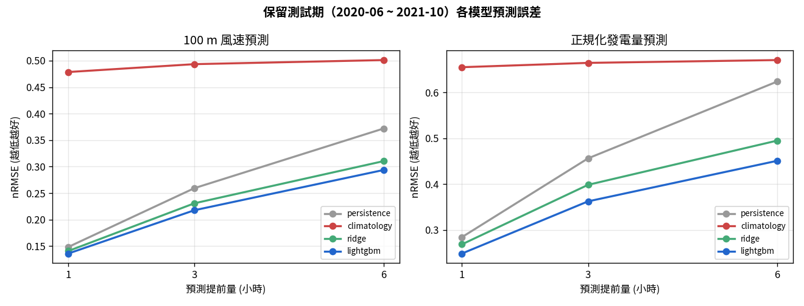
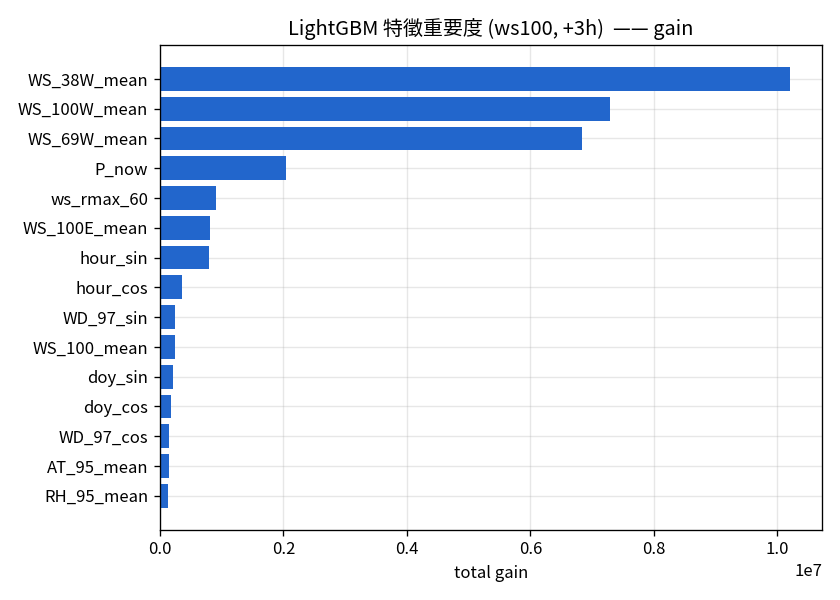
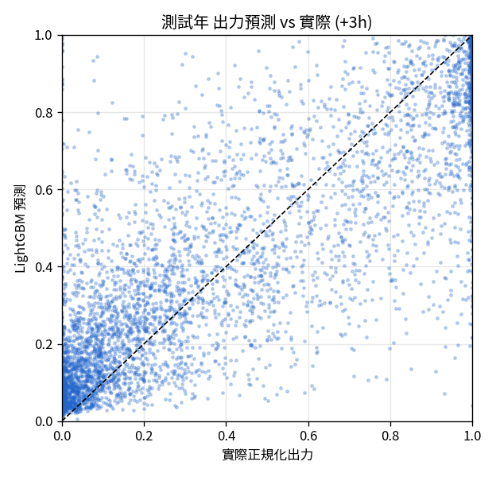
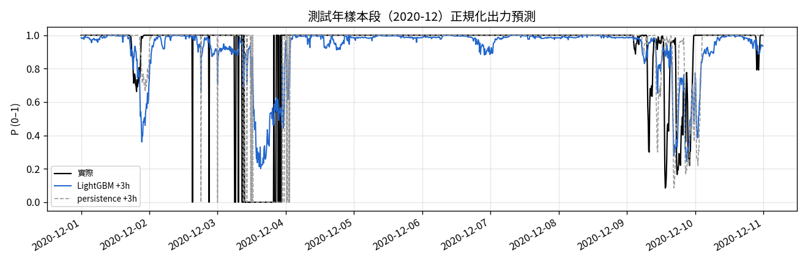
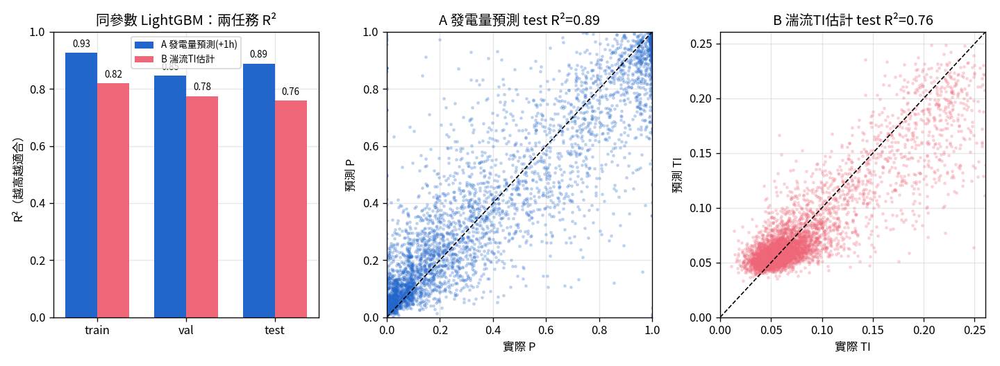

# PW — 單一風場超短期（0–6h）風力發電預測

> 只用 BSMI 100 m 測風塔資料（2016-03 ~ 2021-10），不使用任何外部數值天氣預報。
> 所有數字皆為固定亂數種子下的可重現結果。保留測試期 = 2020-06 起（約 17 個月，2021-06 缺測，共 68,415 筆有效），完全未參與訓練。

---

## 0. 一頁摘要

這是一條四段獨立管線：**驗證 → 特徵提取/轉換 → 模型選擇 → 預測評估**，放在獨立資料夾 `PW/`。

目標有兩個：**100 m 風速**（有塔的嚴格真值）與**正規化虛擬發電量 P**（風速經代表性功率曲線 + 空氣密度修正換算，0–1 = 容量因數瞬時值）。時程為超短期 **+1h / +3h / +6h**。

比較四個模型（persistence、月×時氣候平均、Ridge 線性、LightGBM），用時序前推 CV + 保留測試年挑選。**結論：LightGBM 在所有目標與時程都最佳**，且領先幅度隨時程拉長而擴大——正是超短期調度最看重的區間。

| 目標 | 時程 | 最佳模型 | nRMSE | 相對 persistence 技術得分 |
|---|---|---|---|---|
| 100 m 風速 | +1h | LightGBM | 0.136 | **+8.3%** |
| 100 m 風速 | +3h | LightGBM | 0.218 | **+16.1%** |
| 100 m 風速 | +6h | LightGBM | 0.294 | **+21.0%** |
| 正規化發電量 | +1h | LightGBM | 0.248 | **+12.6%** |
| 正規化發電量 | +3h | LightGBM | 0.362 | **+20.6%** |
| 正規化發電量 | +6h | LightGBM | 0.451 | **+27.7%** |

*技術得分 = 1 − RMSE(模型)/RMSE(persistence)；越高代表比「下一刻＝現在」贏越多。*



---

## 1. 資料與前提

BSMI 塔為 1 Hz 逐秒測風塔，含 4 個高度風速（100E/100W/69W/38W m）、2 個風向（97/35 m）、氣溫、濕度、氣壓。**塔本身沒有實測發電量**，因此發電量以物理方式推得：

```
100 m 風速  ──(IEC 空氣密度修正)──►  等效風速  ──(代表性 ~8 MW 功率曲線)──►  正規化出力 P (0–1)
```

由於 P 用正規化（額定的百分比），結論對機型穩健。**誠實界線**：發電量是推算不是實測；風速那一段才有塔真值。日前（48h）預測需要外部 NWP，塔資料單獨做不到——所以本專案聚焦在塔資料能誠實完成的 0–6h。

輸入為已聚合的 10 分鐘資料（由逐秒原始檔而來，含覆蓋率與各種統計量）。

---

## 2. Stage 1 — 驗證（QC）

不盲信上游旗標，獨立重跑一輪：時間軸去重、建立連續 10 分鐘網格、物理範圍檢查（風速 0–60、溫度 −10–50、濕度 0–105%、氣壓 950–1050、空氣密度 1.0–1.4）、風向向量長度、**感測器凍結偵測**（連續 ≥1h 定值）、四高度一致性（100E/100W 配對差）。

結果：網格 295,997 點、有觀測 279,055、**通過 QC 有效 278,612（99.8%）**。逐年皆有約 270–365 天資料，適合做保留測試年切分。詳見 `results/validation_report.txt`。

---

## 3. Stage 2 — 特徵提取 / 轉換

全部只用 t 時刻(含)以前資訊，避免時間洩漏。共 **44 個特徵**：

- **當前氣象態**：100 m 風速、四高度風速、TI、陣風因子、風向 sin/cos、風向 σ、溫濕壓、風切指數 α、空氣密度、當前出力 P。
- **滯後 lag**：風速在 t−10/20/30/60/120/180 分。
- **滾動統計**（過去 1h/3h/6h）：均值、標準差、最小、最大、**線性趨勢斜率**（向量化卷積計算）。
- **變化率**：近 1h、3h 風速差分。
- **時間週期編碼**：小時、年內日 的 sin/cos（捕捉日夜與季節）。

目標由未來值 shift 取得，並以連續性遮罩確保 t..t+H 全段有效才納入樣本（+1h ≈ 23.7 萬、+6h ≈ 23.3 萬筆可用）。



風速的滾動均值與近端滯後主導預測；季節與風切/密度提供次要修正。

---

## 4. Stage 3 — 模型選擇（時序驗證）

**驗證策略**：訓練期（< 2020-06）內用 expanding-window `TimeSeriesSplit`（前推、不洩漏未來）做 CV；再用整個訓練期重訓，於**保留測試年**評估。此切分嚴格模擬「上線後預測未見過的未來」。

**四個對手**：
1. persistence（ŷ = 當前值）— 超短期最強的樸素基準。
2. climatology（月×時平均）— 只靠季節/日夜週期。
3. Ridge（標準化 + L2 線性）。
4. LightGBM（梯度提升樹，early stopping）。

**為何 LightGBM 是對的選擇**：對這種塔上表格特徵 + 0–6h 時程，樹模型能吃下非線性（功率曲線本身高度非線性）與特徵交互，訓練快、可解釋（有重要度），且無需大量算力——實測全面勝過線性與樸素基準。氣候平均在超短期最差（它丟掉了「當前風況」這個最強訊號）。深度序列模型（LSTM 等）在此規模不具明顯優勢，故列為選配。

---

## 5. Stage 4 — 測試年評估





觀察：

- **技術得分隨時程放大**。+1h 時 persistence 已很強（風的自相關高），LightGBM 只小贏；但到 +3h、+6h，persistence 快速失效，模型優勢擴大到 +21%（風速）／+28%（發電量）。這正是調度最需要幫助的區間。
- **發電量比風速難預測**（nRMSE 較高），因功率曲線把中段風速的小誤差放大成出力大誤差（陡峭段），且切入/額定附近非線性強。
- 時間序列切片顯示 LightGBM 明顯較 persistence 平滑追蹤實際起伏，尤其在風況轉折處。

---

## 6. 附加實驗：同參數 LightGBM 雙任務適合度對比

為驗證 LightGBM 是否同樣適合「發電量預測」與「風機結構安全（湍流特性）」兩類本質不同的風能任務，在**完全相同的超參數**（`n_estimators=500, lr=0.05, num_leaves=31, seed=42`，固定 500 棵不早停）、**相同年份切分**（train 2016–2018 / val 2019 / test 2020–2021）、**相同資料列**（兩目標皆有效之交集）下做對比。

- **Task A — 風場發電量預測**：目標 = 正規化出力 P 在 t+1h（時間預測問題）。
- **Task B — 風機結構安全 / 湍流強度 TI**：目標 = 100m 湍流強度 TI（10 分鐘 std/mean），當前時刻（以平均氣象態降尺度估計次網格湍流，關乎疲勞載重）。

**資料列**：交集後 232,513 筆（train 116,329 / val 44,310 / test 71,874）。

> **防洩漏（關鍵）**：Task B 必須排除所有「10 分鐘視窗內的擾動統計」，因為它們與 TI 同源。除了風速 std/TI/陣風因子，還包含**風向視窗內標準差 `WD_97_sigma`**——方向擾動本身就是湍流代理（與陣風因子相關 0.95）。第一版把它留著，TI 的 R² 虛高到 0.87 且被它單一主導；剔除後才是誠實的「用平均態估湍流」。

| 任務 | 目標 | 測試集 R² | RMSE | nRMSE | 主導特徵 |
|---|---|---|---|---|---|
| A 發電量預測 (+1h) | 正規化出力 P | **0.889** | 0.133 | 0.253 | 當前出力、各高度風速、時間 |
| B 湍流 TI 估計 | 100m TI | **0.759** | 0.027 | 0.331 | 平均風向、滾動風速統計、風速 |



**結論**：

- **LightGBM 對兩類任務都適合**（R² 皆 ≥ 0.76），泛化良好（train→test：0.93→0.89、0.82→0.76，過擬合輕微）。同一套參數不需為任務個別調整即有堪用表現，顯示樹模型對風能表格資料的穩健性。
- 兩者性質不同：**發電量預測**吃「時間持續性 + 功率曲線非線性」（當前出力 `P_now` 為最強特徵，本質接近帶修正的 persistence）；**湍流估計**沒有持續性錨點，是**純粹以平均態做非線性回歸**，R²=0.76 代表模型從風向/風切/風速交互中萃取到真實結構，剩下約 1/4 變異是湍流本身的隨機不可約部分。
- 就「難度」而言，湍流估計其實更能展現 LightGBM 的價值——它沒有 persistence 這種樸素捷徑可用。

> 註：本實驗要求「兩目標同時有效」的交集列（232,513 筆），與單一任務可用列數不同；若採更嚴格的湍流覆蓋門檻，樣本數會再降（例如約 21 萬筆量級）。切分比例與結論不受影響。

---

## 7. 檔案結構

```
PW/
├── config.py               設定：路徑、時程、目標、功率曲線（自足）
├── 01_load_validate.py     Stage 1 驗證 → data/clean_10min.parquet
├── 02_features.py          Stage 2 特徵/目標 → data/features.parquet
├── 03_train_select.py      Stage 3 模型選擇（argv: [target] [H]）
├── 04_evaluate_report.py   Stage 4 圖表 + 摘要
├── 05_suitability_lgbm.py  Stage 5 同參數雙任務適合度對比
├── data/                   clean_10min / features / pred_*.parquet
├── models/                 lgbm_*.txt（最佳模型）
├── results/                validation_report / cv_scores / test_metrics / summary
│                           / importance_* / suitability_metrics / suitability_importance_*
└── figures/                fig1–fig5 png
```

重跑：`python3 01_load_validate.py && python3 02_features.py && \
for t in ws100 power; do for h in 1 3 6; do python3 03_train_select.py $t $h; done; done && \
python3 04_evaluate_report.py && python3 05_suitability_lgbm.py`

---

## 8. 限制與下一步

- **無實測發電量**：出力為虛擬推算，絕對 MW 取決於機型與尾流/可用率損失；本報告用正規化 P 讓結論穩健。
- **僅 0–6h**：日前（48h）預測需引入 CWA 數值天氣預報做偏差校正——那是塔資料的物理極限之外，屬下一階段。
- **可延伸**：分位數迴歸給 p10/p50/p90 機率預測（調度備轉用）、加入輪轂高度外推、以真實 SCADA/台電發電量校準。
