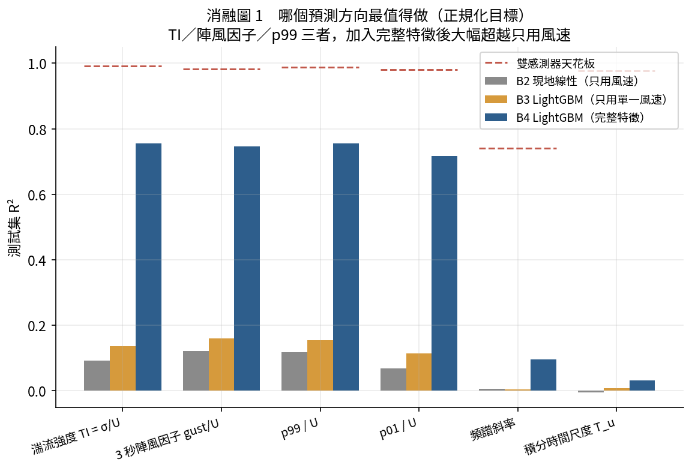
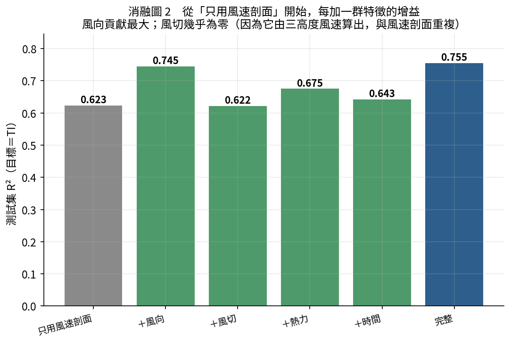
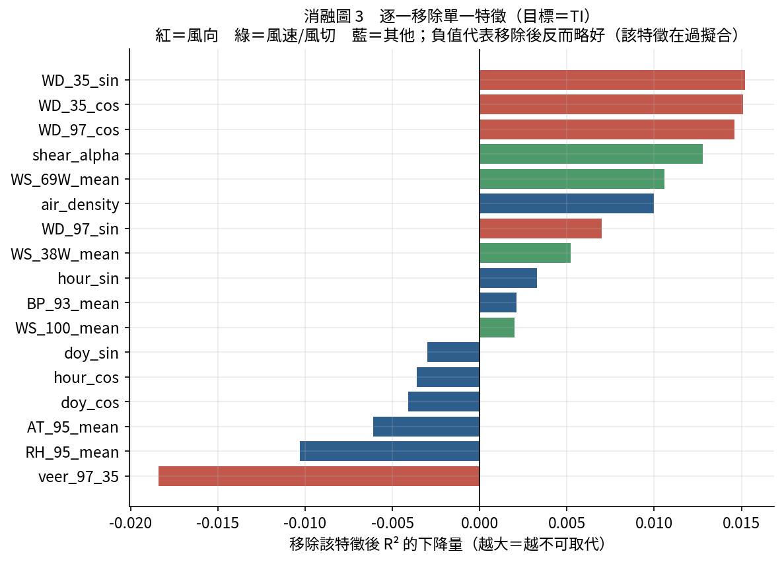
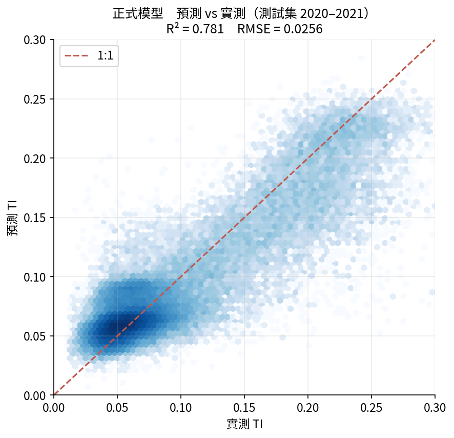
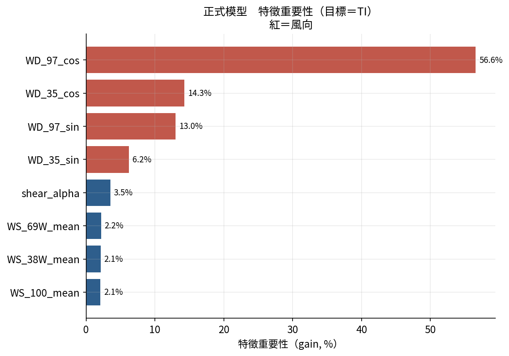
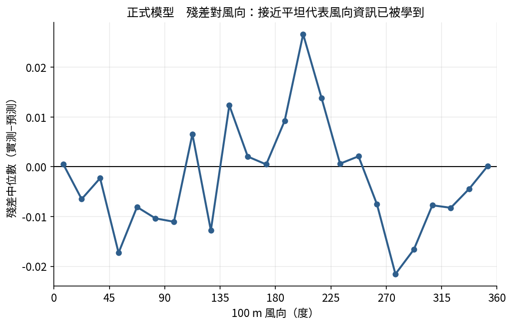
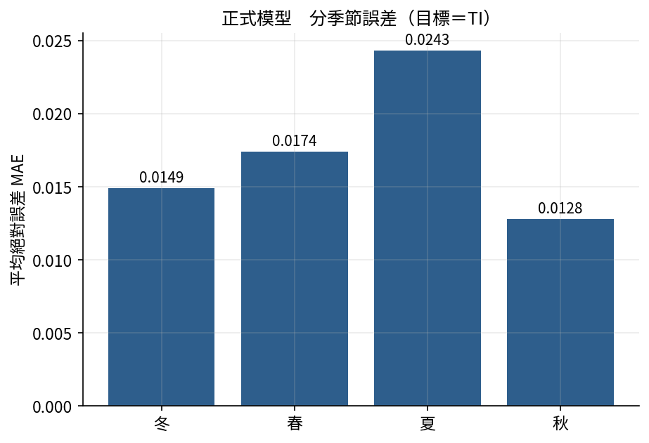

# 消融實驗與正式訓練　總報告

> BSMI 100 m 測風塔 · 完整 66 個月（2016-03 ~ 2021-10）· 湍流降尺度
> 本報告整合：完整資料處理 → 消融實驗（找最佳預測方向與特徵）→ 正式訓練 → 結論
> 所有數字皆為**測試集**（2020–2021，模型從未見過）表現，亂數種子固定，可完全重現。

---

## 摘要

1. **資料規模**：從 17 個抽樣月份擴充到**全部 66 個月**，建模資料 211,564 筆 10 分鐘紀錄（風速 ≥ 4 m/s）。
2. **最佳預測方向**：**湍流強度 TI = σ/U**。在六個正規化目標中，它的「加入完整特徵相對只用風速」提升最大（+0.66），且噪聲天花板最高（0.99）。陣風因子、p99/U 幾乎同等好。
3. **最關鍵特徵**：**風向**。移除風向群組，R² 掉 0.074（所有群組之冠）；在最終模型裡，四個風向分量佔特徵重要性的 **90%**。
4. **最精簡有效模型**：消融發現熱力與 `veer_97_35` 等特徵**有害**。最終勝出的是只含 **8 個特徵**（風速剖面＋風切＋風向）的 `core8`，用 8 個特徵打敗 17 個特徵。
5. **正式模型表現**：TI 測試集 **R² = 0.781、RMSE = 0.0256**（滿分天花板 0.99）。

---

## 1. 完整資料處理

| 項目 | 內容 |
|---|---|
| 原始月份 | 66（僅整月缺 2020-03、2021-06） |
| 10 分鐘平均表 | 285,189 列 × 48 欄 |
| 湍流目標表 | 285,189 列 × 35 欄 |
| 合併後有效樣本 | 278,342 列（97.6% 通過品管） |
| 建模用（風速 ≥ 4 m/s） | 211,564 列 |

處理過程修正了兩個真實資料問題：**原子寫入**（平行批次被中斷不會留下半截檔）、以及**跳過損毀列**（2019-05 有一列欄數錯亂）。切分方式：訓練 2016–2018、驗證 2019、測試 2020–2021。

---

## 2. 消融實驗（一）：哪個預測方向最值得做

對 8 個目標各跑四階基準線（常數 / 線性 / 只用單一風速 / 完整特徵），比較測試集 R²：



| 預測目標 | B0 常數 | B2 線性 | B3 只用風速 | B4 完整 | 雙感測器天花板 | B2→B4 提升 |
|---|---|---|---|---|---|---|
| **湍流強度 TI = σ/U** | −0.02 | 0.09 | 0.14 | **0.755** | 0.991 | **+0.662** |
| p99 / U | −0.01 | 0.12 | 0.16 | 0.755 | 0.988 | +0.638 |
| 3 秒陣風因子 gust/U | −0.01 | 0.12 | 0.16 | 0.747 | 0.983 | +0.624 |
| p01 / U | −0.02 | 0.07 | 0.11 | 0.716 | 0.980 | +0.649 |
| 頻譜斜率 | 0.00 | 0.01 | 0.01 | 0.095 | 0.741 | +0.089 |
| 積分時間尺度 T_u | 0.00 | 0.00 | 0.01 | 0.031 | 0.977 | +0.036 |
| 〔對照〕3 秒陣風（未正規化） | 0.00 | **0.979** | 0.979 | 0.991 | 1.00 | +0.012 |
| 〔對照〕p99（未正規化） | 0.00 | **0.983** | 0.983 | 0.993 | 1.00 | +0.010 |

**兩個關鍵判讀：**

- **贏家是 TI**（以及緊追的 p99/U、gust/U）。這三個正規化目標，只用風速都在 R² 0.1 上下掙扎，加入完整特徵後全部跳到 0.72–0.76，機器學習的加值最大、最實在。
- **未正規化目標是陷阱**。陣風、p99 直接預測時，光用線性就有 R²=0.98——但那只是因為它們 ≈ 風速 × 常數，機器學習只多貢獻 0.01。這證明了**一定要用正規化目標**，否則會得到虛高、沒有意義的分數。

---

## 3. 消融實驗（二）：每個特徵到底貢獻多少

以勝出目標 TI 進行兩種消融。

### 3.1 特徵群：從「只用風速剖面」逐一加群



| 特徵集 | 測試集 R² | 相對只用風速 |
|---|---|---|
| 只用風速剖面（3 高度） | 0.623 | — |
| ＋風切 | 0.622 | ≈ 0（風切由三高度風速算出，重複） |
| ＋時間 | 0.643 | +0.020 |
| ＋熱力 | 0.675 | +0.052 |
| ＋風向 | **0.745** | **+0.122** |
| 完整（全部） | 0.755 | +0.132 |

**風向的增益是所有群組裡最大的**。而「風切」加了幾乎沒用——因為風切指數 α 本來就是從三個高度的風速算出來的，資訊與風速剖面重複。這是消融才看得出來的重要洞見。

（註：此處「只用風速剖面」用了三個高度的風速，已隱含穩定度資訊，所以 R² 高達 0.62，遠高於「只用單一 100 m 風速」的 0.14。）

### 3.2 群組 leave-one-out：移除哪一群損失最大

| 移除的群組 | 移除後 R² | R² 下降（= 邊際貢獻） |
|---|---|---|
| **風向** | 0.681 | **0.074** ← 最不可取代 |
| 風速剖面 | 0.725 | 0.030 |
| 風切 | 0.742 | 0.013 |
| 時間 | 0.752 | 0.003 |
| 熱力 | 0.768 | **−0.013** ← 移除反而更好 |

### 3.3 逐特徵 leave-one-out：驗證每一個特徵



**最不可取代的前五名**（移除後 R² 掉最多）全是風向或風切：
`WD_35_sin`、`WD_35_cos`、`WD_97_cos`、`shear_alpha`、`WS_69W_mean`。

**移除後反而變好的（= 多餘甚至有害）**：`veer_97_35`（−0.018）、`RH_95_mean`（−0.010）、`AT_95_mean`（−0.006）、`doy_cos`、`hour_cos`。

這直接指出：**熱力群組與 `veer_97_35` 應該從模型剔除**，這也決定了正式訓練的特徵集選擇。

---

## 4. 正式訓練

### 4.1 特徵集選擇（用驗證集決定）

根據消融結論，比較三個候選特徵集：

| 特徵集 | 特徵數 | 驗證集 R² | 測試集 R² |
|---|---|---|---|
| full17（全部） | 17 | 0.7905 | 0.7618 |
| pruned14（去掉 veer、AT、RH） | 14 | 0.7964 | 0.7861 |
| **core8（風速剖面＋風切＋風向）** | **8** | **0.8133** | 0.7807 |

**core8 以最少的特徵拿下最高驗證分數**，且測試分數與 pruned14 打平、明顯優於 full17。這證實了消融的判斷：把無關的熱力與時間特徵丟掉，模型更簡單也更好（減少過擬合）。最終採用 **core8**。

### 4.2 最終模型表現（測試集 2020–2021）

| 目標 | 測試 R² | RMSE | MAE | 迭代輪數 |
|---|---|---|---|---|
| **湍流強度 TI** | **0.781** | 0.0256 | 0.0174 | 2214 |
| p99 / U | 0.757 | 0.0554 | 0.0378 | 758 |
| 3 秒陣風因子 gust/U | 0.748 | 0.0635 | 0.0433 | 632 |



點沿 1:1 線分布、無明顯系統性偏差。這是用 2016–2018 訓練、直接預測 2020–2021 的誠實外推結果。

### 4.3 最終模型看什麼



在 8 個特徵裡，四個風向分量合計佔 **90%**（`WD_97_cos` 一個就 57%）。風速三高度合計約 6%，風切 3.5%。**湍流強度幾乎完全由風向決定**——這是本專案最紮實的結論，且用完整資料、嚴謹消融再次確認。



殘差對風向大致平坦（多在 ±0.02 內），代表風向資訊已被模型充分吸收；殘留的小幅結構是進一步改進的空間。



---

## 5. 物理解讀

為什麼是風向？海岸站址不同方向的上風地表粗糙度差異極大：吹過開闊海面的氣流平順（低 TI），吹過陸地／建物的氣流被擾動（高 TI）。平均風速看不出這件事，風向可以。這也解釋了為什麼「三高度風速剖面」已能達到 0.62——它隱含了穩定度；而風向再補上 +0.12，把地表粗糙度的方向性也帶進來。

---

## 6. 誠實的負面結果

| 目標 | 最佳 R² | 天花板 | 判讀 |
|---|---|---|---|
| 積分時間尺度 T_u | 0.031 | 0.977 | 量得準（雙感測器 0.98），但**不由 10 分鐘平均狀態決定** |
| 頻譜斜率 | 0.095 | 0.741 | 預測不了，且天花板本身就低（量測噪聲大） |

T_u 這個結果最有價值：它證明「積分尺度是實在的物理量，但塔上的平均狀態不足以預測它」，比較可能取決於邊界層高度這類需要外部資料（如 ERA5）的資訊。能區分「量不準」與「量得準但無法預測」，靠的正是雙感測器天花板。

---

## 7. 檔案與可重現性

```
ml_project/
├─ preprocess.py                     1 Hz → 10 分鐘平均（原子寫入、跳過損毀列）
├─ extract_turbulence.py             1 Hz → 湍流目標（約化頻率頻譜）
├─ ablation/
│   ├─ prepare_data.py               合併成建模表 model_data.parquet
│   ├─ run_ablation.py               60 個消融實驗（可續跑）
│   ├─ analyze.py                    彙整表 + 3 張消融圖
│   ├─ results/ablation_raw.csv      每個實驗一列
│   ├─ results/summary_*.csv         跨目標 / 特徵群 / 逐特徵 彙整
│   └─ figures/ab1–ab3.png
└─ final_model/
    ├─ final_train.py                特徵集選擇 + 正式訓練（可續跑）
    ├─ model_tgt_{ti,gustfac,p99n}.txt   LightGBM 模型
    ├─ importance_*.csv / final_metrics.csv
    └─ figures/final1–final4.png
```

所有 LightGBM 固定 `seed=42`。消融用快速參數（相對比較），正式訓練用較充分參數（lr=0.03、early stopping）。重跑指令：

```bash
python ablation/prepare_data.py
python ablation/run_ablation.py      # 重複執行到「全部完成」
python ablation/analyze.py
python final_model/final_train.py    # 重複執行到「全部完成」
```

---

## 8. 一句話總結

> 用完整 66 個月資料、60 個消融實驗與嚴謹的特徵驗證，確認：**湍流強度是最值得預測的方向，而它幾乎完全由風向決定**——一個只用 8 個特徵的模型，就能在測試集達到 R² 0.78（滿分 0.99）。

（給非專業讀者的圖文版入門，見 `湍流降尺度_教學網頁.html`。）
