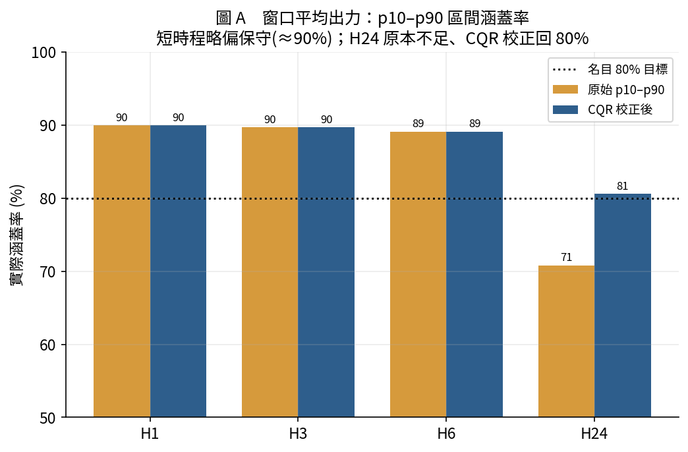
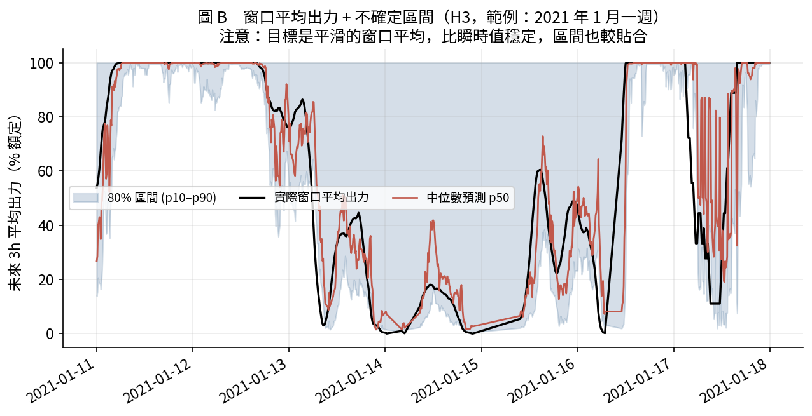

# 兩種「區間」發電預測系統　對照總報告

> 一份文件講清楚兩套系統：**窗口平均（總能量）預測** 與 **瞬時不確定性區間預測**。
> 兩者互補，合起來就是一套完整的風場發電預測系統。全部只用 BSMI 測風塔（虛擬風場出力），不需外部 NWP。

---

## 0. 為什麼會有「兩種區間」

中文的「區間」被用在兩個完全不同的意思上，這是一切混淆的根源：

| 「區間」的意思 | 指什麼 | 對應系統 |
|---|---|---|
| **時間**的區間 | 未來一段時間 [t+1, t+H] 的**平均／總量** | 系統 A |
| **不確定性**的區間 | 某個預測值的**可信範圍** p10–p90 | 系統 B |

兩者都叫「區間預測」，但回答的是不同問題。本報告把兩套都做完整，並讓**系統 A 也補上不確定性區間**，於是得到一個二維完整系統：

```
                   給「一個數」            給「一個範圍」(不確定性)
   未來窗口平均   系統A 點預測(原有)  →   系統A + p10–p90 (本次新增)
   某一瞬時值     —(通常不需要)          系統B 機率區間(先前完成)
```

---

## 1. 系統總覽

| | 系統 A：`power_forecast_interval_ge` | 系統 B：`power_interval_forecast_cl` |
|---|---|---|
| 預測標的 | 未來 H 小時的**平均出力**（≡ 總能量）| **某一瞬時**的出力 |
| 「區間」意義 | 時間窗口 | 不確定性範圍 |
| 時程 | 1 / 3 / 6 / **24** h | 1 / 3 / 6 h |
| 點模型 | Ridge / XGBoost / LightGBM | — |
| 機率 | **p10 / p50 / p90（本次新增）** | p05…p95 + CQR |
| 主要問題 | 「未來這段時間**總共**發多少電？」 | 「這一刻發多少、**多不確定**？」 |
| 典型用途 | 能量規劃、報量、排程 | 即時平衡、備轉容量 |

---

## 2. 系統 A：窗口平均（總能量）預測 ＋ 新增機率區間

**它預測的是**未來 H 小時的平均出力（乘上額定×H 就是總發電量 MWh）。方法無洩漏、時間切分乾淨、基準線公平（用「過去 H 小時平均」對「未來 H 小時平均」）。

### 點預測品質（原有，最佳模型）

| 提前量 | 出力窗口平均 R² | skill vs persistence |
|---|---|---|
| H1 | 0.955 | +27% |
| H3 | 0.914 | +39% |
| H6 | 0.868 | +44% |
| H24 | 0.720 | +29% |

### 新增：p10–p90 不確定性區間

| 提前量 | 中位數 p50 R² | p10–p90 涵蓋率(CQR) | 區間寬度 |
|---|---|---|---|
| H1 | 0.953 | 90% | 56% 額定 |
| H3 | 0.910 | 90% | 60% |
| H6 | 0.860 | 89% | 64% |
| H24 | 0.693 | 81%（CQR 校正） | 48% |

中位數 p50 的 R² 幾乎完全複製點模型（0.955→0.953 等），證明分位數模型與原點模型一致、可信。短時程的 p10–p90 略偏保守（實際涵蓋 ≈90%）；H24 原本涵蓋不足（71%），CQR 保形校正拉回 81%。





> 注意上圖：**窗口平均出力（黑線）比瞬時值平滑很多**——同樣是 1/17 那場切出強風，這裡因為平均了 3 小時，把 0↔100% 的彈跳抹平了。這正是「總能量」比「瞬時值」好預測的原因。

---

## 3. 系統 B：瞬時不確定性區間

**它預測的是**某一時刻的出力，並用分位數 + CQR 保形校正給出經驗證的區間。

| 提前量 | 中位數 p50 R² | 80% 區間涵蓋率 | 90% 區間涵蓋率 | CRPS |
|---|---|---|---|---|
| 1h | 0.904 | 79.8% | 91.4% | 0.046 |
| 3h | 0.784 | 80.2% | 90.5% | 0.075 |
| 6h | 0.652 | 80.9% | 90.1% | 0.101 |

系統 B 的 80%／90% 區間校準得非常準（都在名目 ±1pp 內），適合直接用於備轉容量規劃。

---

## 4. 直接對照：同樣 3 小時，兩者差在哪

| | 系統 A（窗口平均）| 系統 B（瞬時）|
|---|---|---|
| 預測的量 | 未來 0–3h **平均**出力 | t+3h **那一刻**出力 |
| p50 R² | **0.91** | **0.78** |
| 難度 | 較易（平均平滑掉雜訊）| 較難（要抓到某一瞬間）|
| 區間意義 | 平均值的不確定範圍 | 瞬時值的不確定範圍 |

**關鍵結論**：系統 A 的 R² 比較高，不是模型比較強，而是**目標比較容易**——「未來三小時平均會發多少電」本來就比「下午三點整那一刻發多少」好預測。兩者不是競爭關係，是回答不同問題。

---

## 5. 合起來能做什麼（完整系統）

一個實際的調度早上，兩套系統各司其職：

1. **能量排程（系統 A）**：「未來 24 小時預計平均出力 45%（總發電量約 X MWh），80% 機率在 [30%, 62%] 之間」→ 安排今日機組配比與燃料。
2. **即時平衡與備轉（系統 B）**：「未來 3 小時，每個時刻的出力 90% 區間是 [23%, 68%]」→ 決定要壓多少即時備轉容量。
3. **極端事件警示（兩者共通）**：當**區間突然變寬**（如 1/17 風速逼近切出風速那段），系統自動標記「這段高度不確定、要提高警戒」。

也就是：**系統 A 管「一天大概發多少」，系統 B 管「每一刻有多少把握」。**

---

## 6. 誠實限制（兩套系統共通）

1. **虛擬出力非實測**：出力由功率曲線推算，尾流/可用率/機型為假設。用台電公開容量因數可校準損失。
2. **理想切出風速**：功率曲線在 25 m/s 硬切，實際風機有遲滯（切出後要等風降到 ~22 才復電），故 1/17 那類彈跳在真實中較平緩。
3. **短時程區間略保守**：系統 A 的 p10–p90 在 H1–H6 實際涵蓋 ~90%（偏寬）。對稱 CQR 因出力在 0/1 有點質量而難以收窄，屬機率預測此類資料的已知難點。
4. **逐時日前仍需 NWP**：系統 A 的 H24 是「整日平均」不是「明天某時刻」；要逐小時的日前預測，仍需氣象署數值預報（見 `power_forecast/PLAN_台灣風場日前發電預測.md`）。

---

## 7. 檔案地圖

```
ml_project/
├─ REPORT_對照_兩種區間系統.md              ← 本文件
│
├─ power_forecast_interval/                 系統 A：窗口平均（總能量）
│   ├─ forecast_interval_train.py           點預測（Ridge/XGB/LightGBM）
│   ├─ forecast_interval_quantiles.py       ★新增：p10/p50/p90 + CQR
│   ├─ forecast_interval_quantile_figures.py ★新增：3 張區間圖
│   ├─ results/test_metrics_interval.csv    點預測指標（含 R²）
│   ├─ results/interval_prob_metrics.csv    ★新增：機率區間指標
│   └─ figures/qiv_A/B/C_*.png              ★新增
│
└─ power_interval_forecast/                 系統 B：瞬時不確定性區間
    ├─ train_intervals.py / evaluate.py      分位數 + CQR
    ├─ results/interval_metrics.csv          涵蓋率/寬度/Winkler
    └─ figures/iv1–iv4_*.png
```

重現系統 A 的新增機率區間：
```bash
cd power_forecast_interval
python forecast_interval_quantiles.py          # 重複執行到「全部完成」
python forecast_interval_quantile_figures.py
```

---

## 8. 一句話總結

> 「區間」有兩個意思：**時間**的區間（系統 A，未來一段時間的總能量）與**不確定性**的區間（系統 B，某一刻的可信範圍）。本次把系統 A 也補上 p10–p90，於是得到一套完整系統——**既知道「未來一天大概發多少電」，也知道「每一刻有多少把握」**，全部只靠一座測風塔。
