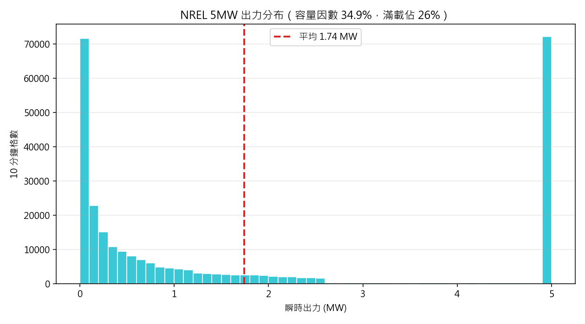
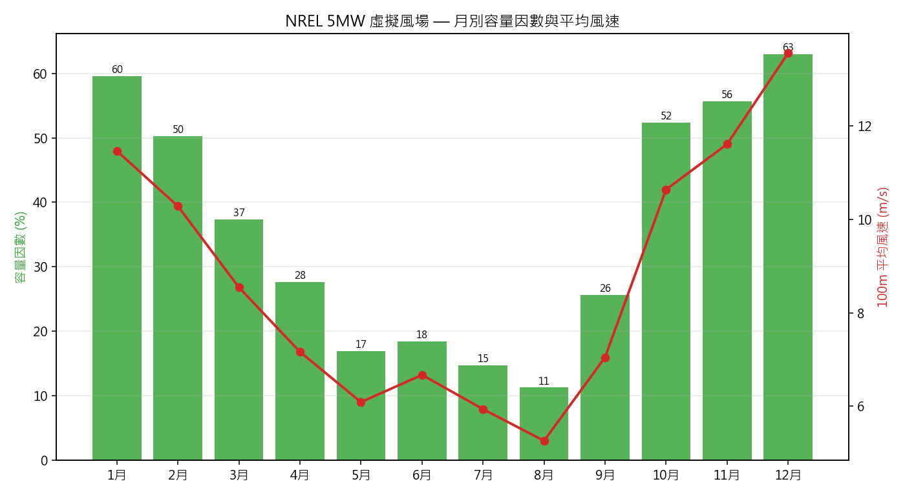
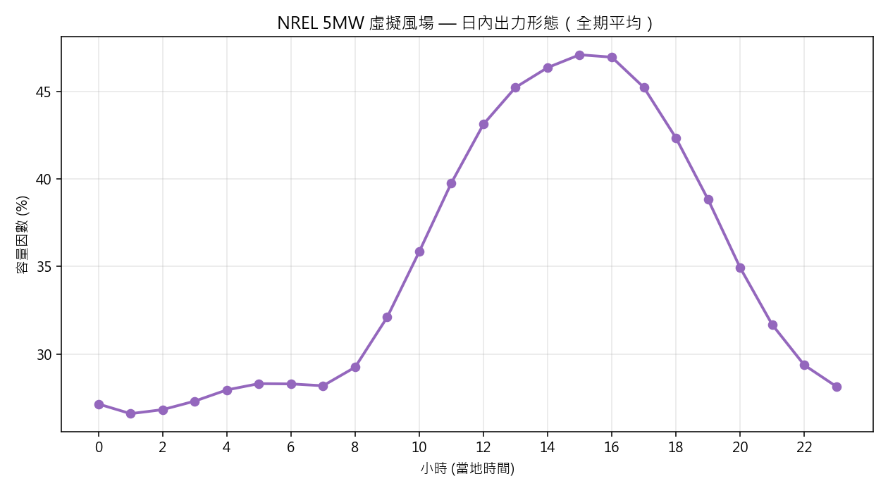
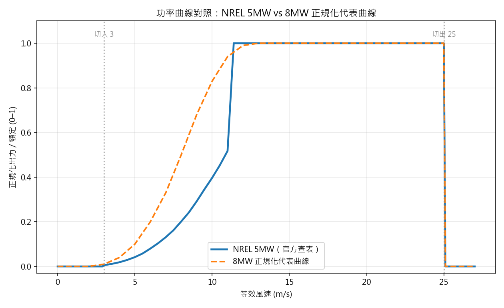
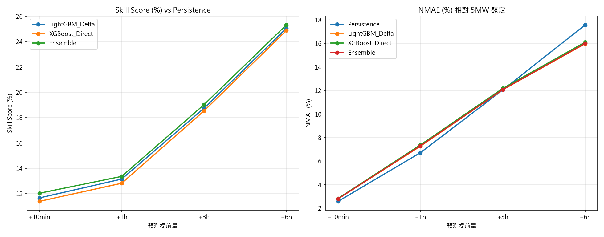
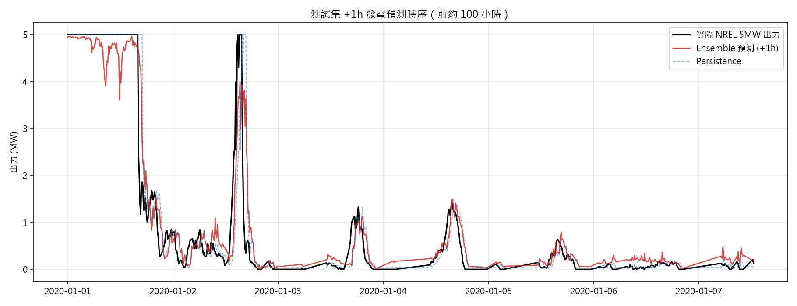

# NREL 5MW 虛擬風場 — 資源評估與發電預測報告

> 用 **NREL 5MW Reference Offshore Wind Turbine** 官方功率曲線（**絕對 MW，額定 5.0 MW**），
> 把 BSMI 測風塔（2016-03 ~ 2021-10，66 個月）當成一座虛擬風場。
> 全部數字皆由 `01_resource_assessment.py` 與 `02_forecast_pipeline.py` 實跑產生。

---

## 0. 這個資料夾在做什麼

專案裡原本有**兩套彼此不一致的功率曲線**：主管線用 NREL 5MW 立方近似（絕對 kW），
其他子專案用正規化 8MW 代表曲線（0–1）。本資料夾把**官方 NREL 5MW 查表曲線**抽成
單一可信來源，統一用**絕對 MW**，並在此基礎上重跑資源評估與發電預測。

功率模型：`v_eff = v · (ρ/1.225)^(1/3)`（IEC 61400-12-1 密度修正）→ 官方 NREL 5MW
查表內插（切入 3.0、額定 11.4、切出 25.0 m/s，額定 5000 kW）。

---

## 1. 資源評估（全期 278,342 筆有效 10 分鐘格）

| 指標 | 值 |
|---|---|
| 平均出力 | **1.743 MW** |
| 容量因數 CF | **34.9%** |
| 等效滿載時數 | **3,054 h/年** |
| 單機年發電量 | **15,272 MWh** |
| 滿載（達 5 MW）時間佔比 | 25.9% |
| 出力為 0（含低於切入、超過切出）佔比 | 14.8% |

CF 34.9% 對台灣冬季強東北季風的場址是合理量級（此塔冬季風況品質接近離岸）。
注意這是**理想虛擬出力**——未計尾流、可用率、電氣損失，實場會再打折。



### 季節形態極強（訓練集務必含完整年份）

| 月 | 容量因數 | 100m 平均風速 |
|---|---|---|
| 12 月 | **63.0%** | 13.55 m/s |
| 1 月 | 59.6% | 11.46 m/s |
| 10–11 月 | 52–56% | 10.6–11.6 m/s |
| 8 月 | **11.3%** | 5.26 m/s |
| 5–7 月 | 15–18% | 5.9–6.7 m/s |

冬夏容量因數差近 **6 倍**（12 月 63% vs 8 月 11%），與 PLAN.md 記載的季節訊號一致。




---

## 2. 功率曲線對照：NREL 5MW vs 8MW 正規化代表曲線

同一份風速，換不同功率曲線，正規化容量因數差很多：

| 功率曲線 | 正規化容量因數 |
|---|---|
| **NREL 5MW（官方查表）** | **34.9%** |
| 8MW 正規化代表曲線 | 45.1% |

差距來自曲線中段：在 8–10 m/s 這段常見風速，NREL 5MW 還在爬坡（10 m/s 僅
1984/5000 ≈ 0.40 額定），而 8MW 代表曲線已達 0.68–0.83。**NREL 5MW 是一條比較
「硬」的曲線**，中風速出力較保守，所以整體 CF 較低。這說明「虛擬出力的絕對數字
高度依賴假設機型」——結論該看形態與技術得分，而非絕對 CF。



---

## 3. 多時程發電預測（標的＝NREL 5MW 絕對 MW）

方法無洩漏：時間切分（訓練 2016–2018 共 118,482 筆、測試 2020–2021 共 73,123 筆，
2019 當緩衝）；基準線為 Persistence；主模型 LightGBM Delta、XGBoost Direct、
兩者 50/50 Ensemble。指標相對 5 MW 額定歸一化。

| 提前量 | 模型 | RMSE (MW) | NMAE (%) | R² | Skill vs Persistence |
|---|---|---|---|---|---|
| +10min | Persistence | 0.405 | 2.58 | 0.962 | — |
| +10min | **Ensemble** | **0.356** | 2.80 | **0.971** | **+12.0%** |
| +1h | Persistence | 0.784 | 6.72 | 0.859 | — |
| +1h | **Ensemble** | **0.679** | 7.30 | **0.894** | **+13.4%** |
| +3h | Persistence | 1.208 | 12.05 | 0.667 | — |
| +3h | **Ensemble** | **0.978** | 12.08 | **0.782** | **+19.0%** |
| +6h | Persistence | 1.594 | 17.58 | 0.423 | — |
| +6h | **Ensemble** | **1.190** | 16.00 | **0.678** | **+25.3%** |

（完整四模型逐時程表見 `results/forecast_benchmark.csv`。）

**關鍵觀察**：Skill Score 隨提前量單調上升（12% → 13% → 19% → 25%）。這正是
PLAN.md 的預測——**10 分鐘時 Persistence 已極強、ML 只能小贏；3–6 小時才是機器
學習最有價值的區間**。以絕對 MW 為標的重跑，結論完全成立。




---

## 4. 誠實限制

1. **虛擬出力非實測**：塔無 SCADA，出力全由功率曲線推算；尾流／可用率／機型為假設。
2. **理想硬切出**：25 m/s 直接歸零，真實風機有遲滯（切出後需等風降才復電）。
3. **絕對 CF 依賴機型**：NREL 5MW 34.9% vs 8MW 曲線 45.1%，差 10 個百分點。跨機型
   比較時應看容量因數**形態**與**預測技術得分**，這兩者對機型穩健。
4. **未計損失**：實場 CF 會低於此理想值。可用台電公開容量因數反推整體損失係數校準。

---

## 5. 重現

```bash
cd ml_project/nrel5mw_power
python run_all.py
```
輸出：`results/*.csv` 與 `results/figures/fig1–fig6_*.png`。
