# 虛擬風場：資源評估 + 超短期發電預測

> 只用 BSMI 100 m 測風塔資料（2016–2021，66 個月，278,342 筆有效 10 分鐘紀錄）
> 不使用任何外部數值天氣預報。所有數字皆為可重現結果（固定亂數種子）。

---

## 這份報告在做什麼（先講清楚前提）

BSMI 塔**沒有發電量資料**，所以我們用一條代表性功率曲線（約 8 MW 級離岸機型、含空氣密度修正）把塔的 100 m 風速換算成**虛擬風機出力**。塔因此變成一座「虛擬風場」，可以做兩件有真實價值、且**光靠塔就能完成**的事：

1. **風場資源評估** —— 這個站點的發電潛力有多好（容量因數、發電時數、季節形態）
2. **超短期（0–6 小時）發電預測** —— 對即時調度與備轉有用的預測

**誠實界線**：出力是「風速 × 功率曲線」的物理推算，不是實測；絕對 MW 取決於機型與尾流/可用率損失。因此本報告一律用**正規化出力（0–1，即容量因數）**，讓結論對機型穩健。而「風速」這一段有塔的嚴格真值，可信度高。**日前（48 小時）預測需要外部 NWP，塔資料單獨做不到**（見第 2 節）。

---

## 1. 風場資源評估

### 1.1 核心指標

| 指標 | 數值 | 說明 |
|---|---|---|
| **容量因數 CF** | **45.1%** | 代表性 8 MW 級曲線；離岸優質等級 |
| 等效滿載時數 | **3,949 h/年** | = CF × 8760 |
| 滿載時間占比 | 23.7% | 風速 ≥ 額定的時間 |
| 零出力占比（風太小 <3 m/s） | 14.8% | 切入風速以下 |
| 切出停機（>25 m/s）占比 | 0.52% | 極端強風停機，比例很低 |
| 最佳月 / 最差月 CF | 70.8% / 20.7% | 冬 12 月 vs 夏 8 月 |

**功率曲線敏感度**（換不同機型，CF 的範圍）：低風速機型（額定 10 m/s）46% → 標準（12）38% → 高風速機型（14）31%。**即使最保守也有 31%**，證明這是個好風場。

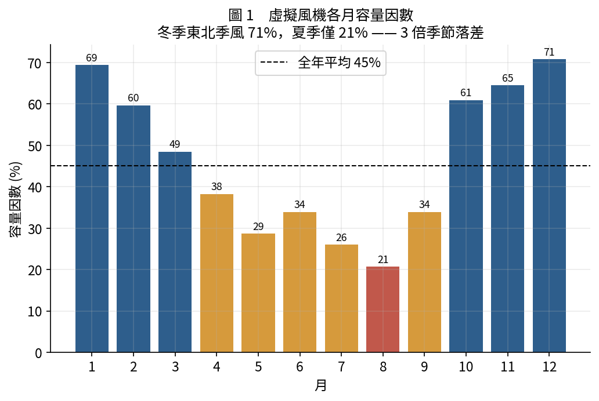

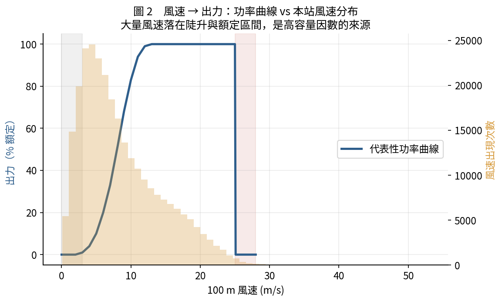

### 1.2 季節與方向

- **強烈季節性**：冬季東北季風時 CF 達 60–71%，夏季僅 16–21%，落差近 4 倍。對電網意味著風電供給與夏季用電尖峰**反相**——這是台灣能源結構的關鍵挑戰。
- **能量方向來源**：發電量高度集中在東北扇區（冬季季風）。
- **年際穩定**：完整年份 CF 落在 45–49%（2016、2021 為不完整年，故偏低），代表風資源可靠、適合長期投資評估。

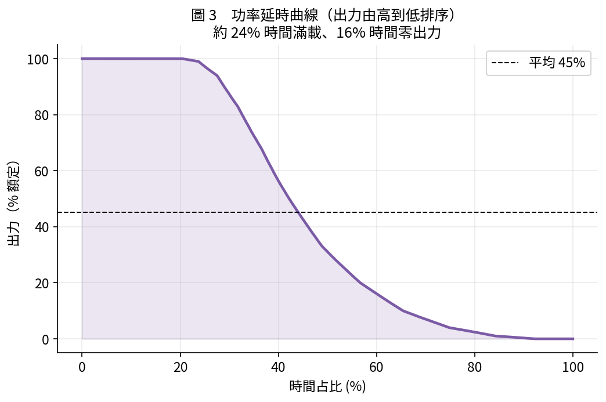

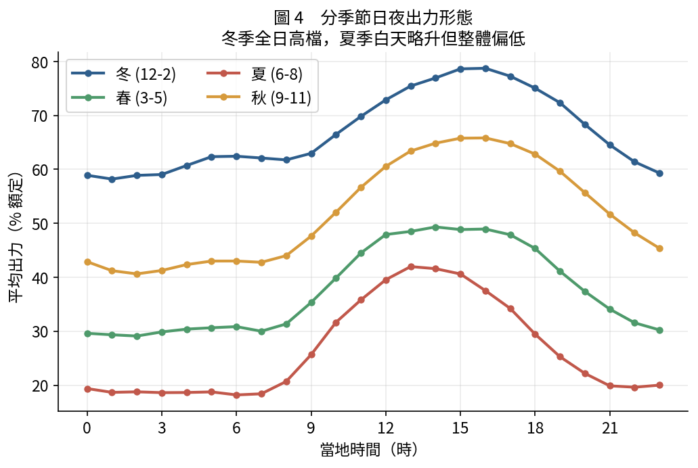

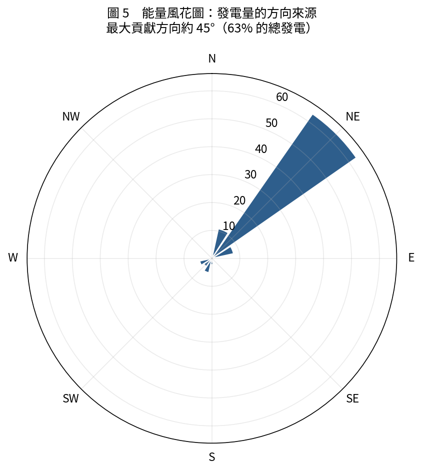

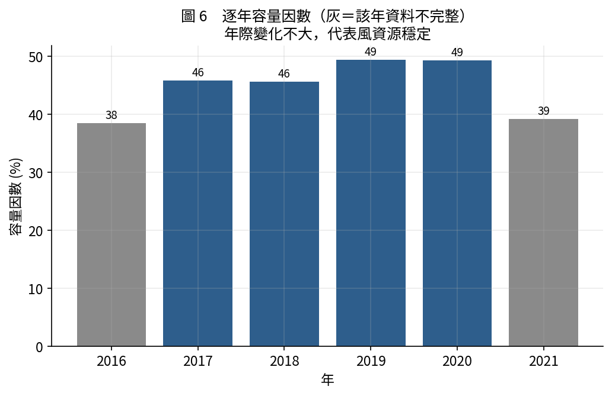

---

## 2. 為什麼只做 0–6 小時（塔資料的物理極限）

用「下一刻＝現在」的 persistence 預測虛擬出力，誤差隨時程快速升高：

| 提前量 | Persistence nRMSE | 對照：氣候平均 |
|---|---|---|
| 30 分 | 10.4% | 36.6% |
| 1 小時 | 13.8% | — |
| 6 小時 | 30.9% | — |
| 24 小時 | 40.5% | 41.3%（等於失效）|

**超過約 6 小時，persistence 就逼近「猜長期平均」而失效。** 塔只有「過去到現在」的觀測，沒有未來的天氣資訊，所以再往後只能靠 NWP。這就是本專案把預測範圍設在 0–6h 的物理原因；日前 48h 請見 `../power_forecast/PLAN_台灣風場日前發電預測.md` 的四段管線。

---

## 3. 超短期（0–6h）發電預測

### 3.1 模型與結果

用塔的近時特徵（出力/風速的 lag、風速趨勢、風向、亂流強度、空氣密度、時間週期）訓練 LightGBM，直接預測未來各時程的出力。切分：訓練 2016–2018、驗證 2019、測試 2020–2021。

| 提前量 | ML nRMSE | Persistence | 氣候平均 | **技術得分 vs persist** | 技術得分 vs 氣候 |
|---|---|---|---|---|---|
| 30 分 | 9.5% | 10.4% | 36.6% | **+8.4%** | +74% |
| 1 小時 | 12.5% | 13.8% | 36.7% | **+9.9%** | +66% |
| 2 小時 | 16.3% | 18.9% | 36.9% | **+13.9%** | +56% |
| 3 小時 | 18.7% | 22.7% | 37.2% | **+17.6%** | +50% |
| 6 小時 | 23.6% | 30.9% | 38.4% | **+23.7%** | +39% |

**兩個重點：**
- **ML 全面打敗 persistence，且時程越長優勢越大**（30 分 +8% → 6 小時 +24%）。因為 persistence 隨時程快速劣化，而 ML 能從風速趨勢、風向、亂流等特徵抓到未來訊號。
- 相對「氣候平均」的技術得分高達 39–74%，證明模型學到的是即時動態、不是季節。

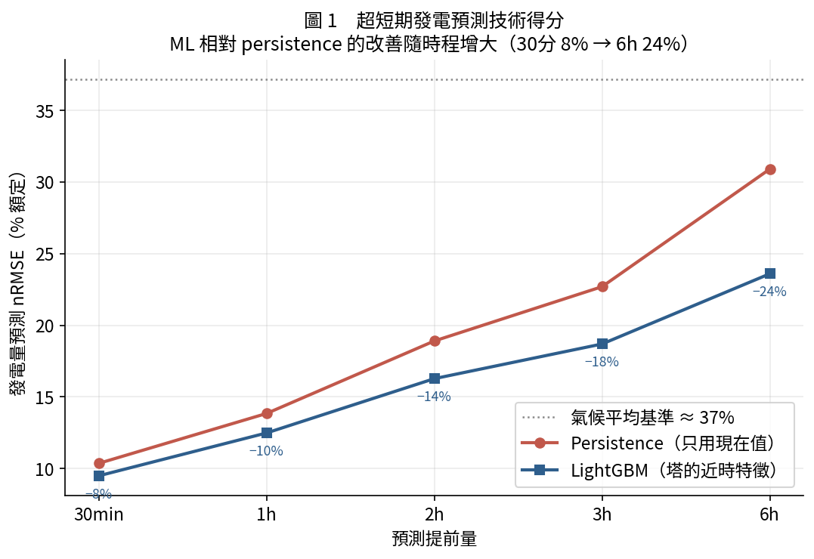

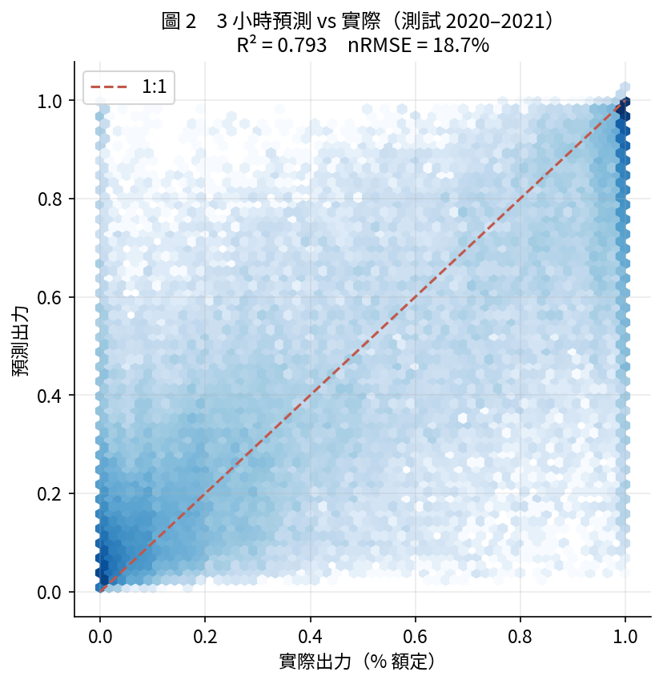

### 3.2 範例：實際 vs 3 小時前預測

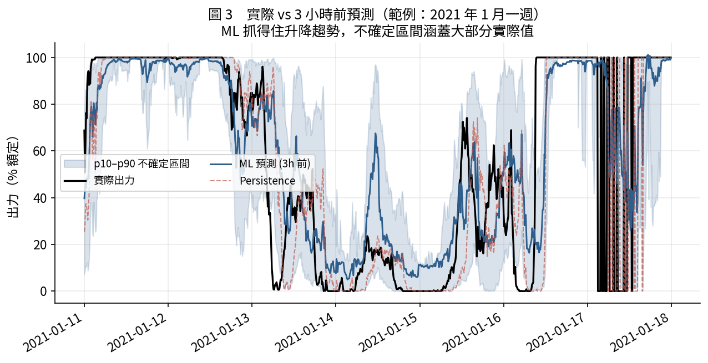

ML 預測（藍）比 persistence（紅虛線）更早抓到升降趨勢，p10–p90 不確定區間涵蓋大部分實際值。

### 3.3 機率預測（不確定區間）

調度需要的不只是一個數字，而是區間。用分位數迴歸輸出 p10/p50/p90（3 小時）。實際涵蓋率：

| 分位 | 目標 | 實際涵蓋率 |
|---|---|---|
| p10 | 0.10 | 0.148 |
| p50 | 0.50 | 0.439 |
| **p90** | **0.90** | **0.902** |

p90 校準良好；p10/p50 略偏高（出力在 0 與額定處各有一團「點質量」，讓低分位較難估）。實務上 [p10, p90] 區間可直接用於備轉容量規劃。

### 3.4 分季節評估

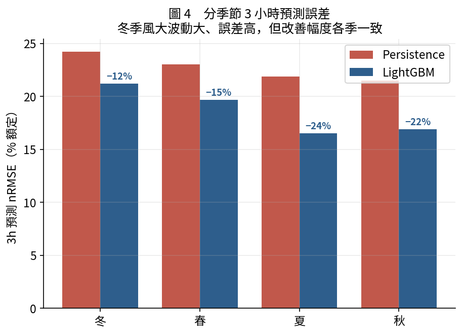

冬季風大、波動大，誤差最高（3h nRMSE 21.2%），但**每一季 ML 相對 persistence 的改善都一致**，代表模型的價值不是靠某個好做的季節撐場面。

### 3.5 模型看什麼

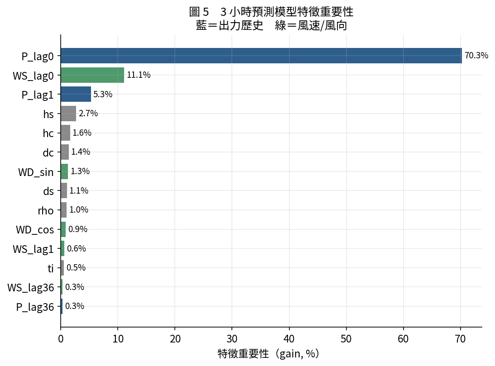

短期預測最重要的是**出力/風速的近時歷史**（自我相關），其次是風速趨勢與風向。這與資源評估的「風向決定湍流」是不同層次的問題——這裡是時間動態，前一個專案是空間/尺度。

---

## 4. 誠實的限制

1. **虛擬出力非實測**：尾流損失、可用率、實際機型都是假設；絕對電量當估計看。可用台電公開的月風機發電量（容量因數）校準損失係數，讓數字更貼近真實。
2. **塔高 = 輪轂高假設**：實際輪轂多在 100–150 m。模組已內建用實測風切外推的功能（`hub_extrapolate`），可換到指定輪轂高度。
3. **0–6h 上限**：日前預測必須引入 CWA 數值預報（見日前預測規劃）。
4. **單塔代表性**：本站結論代表 BSMI 塔所在風況；套到特定外海風場需考慮位置差異。

---

## 5. 檔案與重現

```
power_forecast/
├─ virtual_power.py            功率曲線 + 空氣密度修正 + 虛擬出力（可調機型/輪轂高）
├─ resource_assessment.py      資源評估 → results/ + figures/res1–6
├─ forecast_train.py           0–6h 預測訓練（點 + 分位數，可續跑）
├─ forecast_figures.py         figures/fc1–5
├─ models/                     LightGBM 模型（point_*.txt, quant_*.txt）
├─ results/                    forecast_metrics.csv, resource_stats.json, 預測輸出
└─ figures/                    res1–6（資源）, fc1–5（預測）
```

重現：
```bash
python resource_assessment.py
python forecast_train.py     # 重複執行到「全部完成」
python forecast_figures.py
```

---

## 6. 一句話總結

> 你手上的 BSMI 塔，光靠自己就能變成一座「虛擬風場」：這是個**容量因數 45%** 的優質站點，而且能做出**在 0–6 小時全面打敗 persistence（改善 8–24%）** 的機率型發電預測。要再往日前 48 小時，才需要接氣象署的數值預報。
