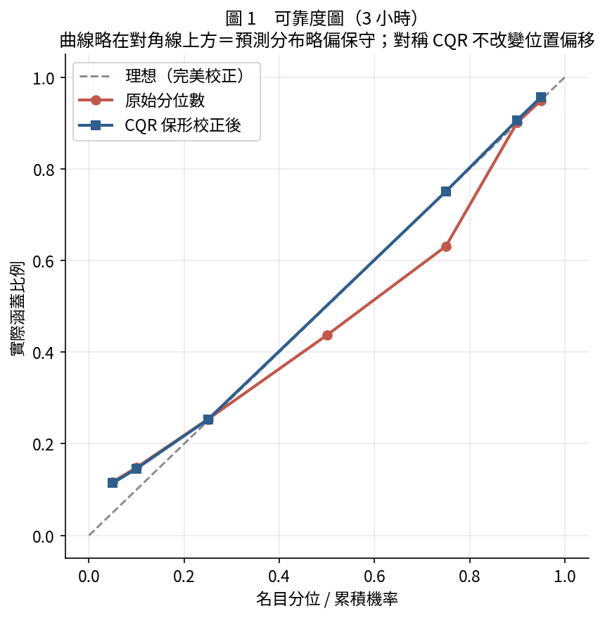
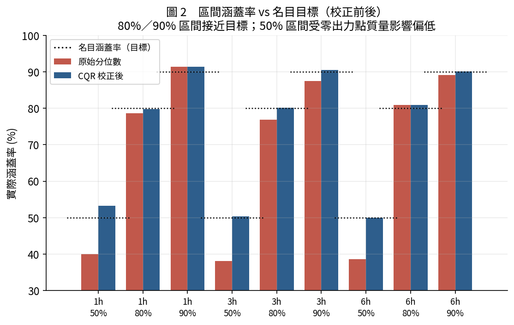
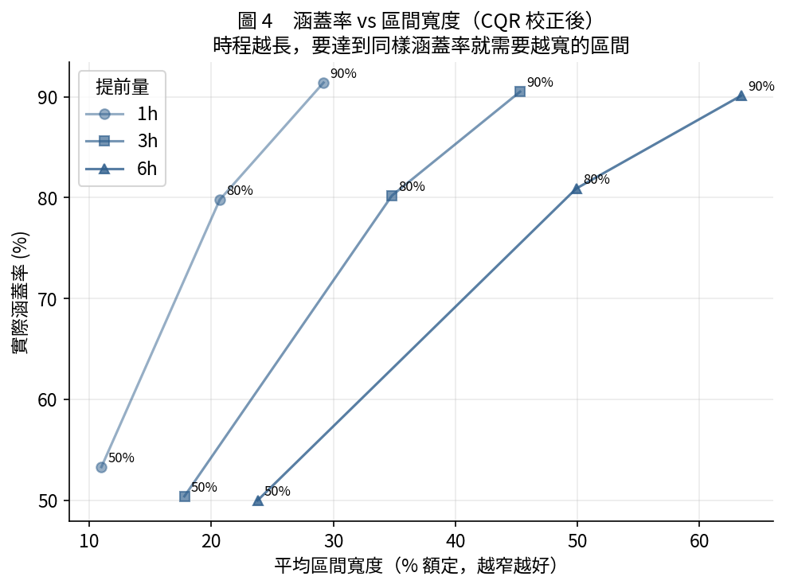
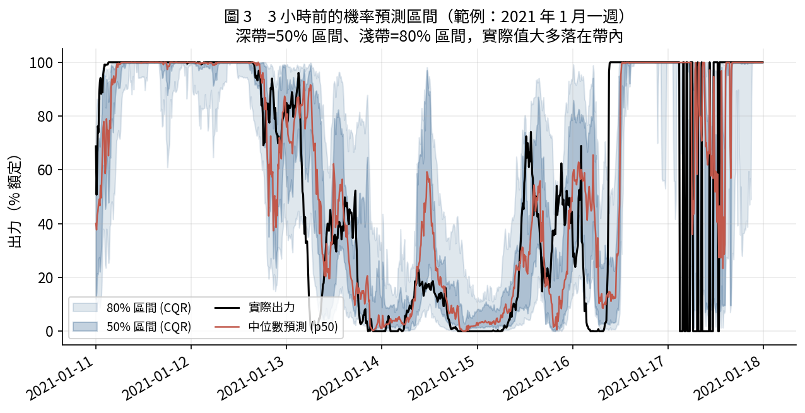

# 發電量「區間」預測（機率預測）

> 只用 BSMI 測風塔資料（虛擬風場出力）· 提前 1 / 3 / 6 小時 · 測試 2020–2021
> 為什麼要做區間：電網要保留多少備轉容量，取決於出力的**不確定範圍**，而不是單一數字。

---

## 這份報告的問題

上一個專案（超短期預測）給的是「3 小時後出力大概 45%」這種**點預測**。但調度真正需要的是：

> 「3 小時後出力有 **80% 機率**落在 **32%–68%** 之間」

這叫**機率／區間預測**。本報告用分位數迴歸產生區間，並用**保形校正（CQR）**讓區間有接近「保證」的涵蓋率，再用機率評分嚴格檢驗。

---

## 方法

| 步驟 | 內容 |
|---|---|
| 1. 分位數迴歸 | 對每個時程（1/3/6h）各訓練 7 條 LightGBM 分位數（p05, p10, p25, p50, p75, p90, p95），共 21 個模型 |
| 2. 單調化 | 逐列排序消除分位數交叉（獨立訓練偶發，約 0.2%） |
| 3. 保形校正 CQR | 用獨立**校正集（2019）**算調整量，讓測試集區間涵蓋率貼齊名目值（理論保證） |
| 4. 機率評分 | 涵蓋率、區間寬度、pinball loss、CRPS、Winkler 區間分數、可靠度圖 |

三段時間切分：訓練 2016–2018 ｜ 校正 2019 ｜ 測試 2020–2021。

**CQR 保形校正原理**：對名目 90% 的區間 (p05, p95)，在校正集算每點「不符合分數」E = max(p05−y, y−p95)，取 E 的 90% 分位數 Q，測試區間放寬為 [p05−Q, p95+Q]。只要資料可交換，測試涵蓋率就會 ≈ 90%。

---

## 結果

### 區間涵蓋率（校正後）

| 提前量 | 名目 50% | 名目 80% | 名目 90% |
|---|---|---|---|
| 1 小時 | 53.3% | 79.8% | 91.4% |
| 3 小時 | 50.4% | 80.2% | 90.5% |
| 6 小時 | 50.0% | 80.9% | 90.1% |

**80% 與 90% 區間校正得非常準**（都在名目值 ±1 個百分點內）。這是最重要的結果——因為備轉容量規劃通常用 90% 區間，而它的實際涵蓋率就是 90–91%，可以直接信任。





### 區間寬度（銳利度）與機率分數

| 提前量 | 90% 區間平均寬度 | pinball loss | CRPS(近似) |
|---|---|---|---|
| 1 小時 | 29% 額定 | 0.0200 | 0.046 |
| 3 小時 | 45% 額定 | 0.0323 | 0.075 |
| 6 小時 | 63% 額定 | 0.0435 | 0.101 |

時程越長，要維持同樣涵蓋率就需要越寬的區間——這正確反映了「越遠越不確定」。1 小時的 90% 區間只有 29% 額定寬，相當精準；6 小時就得放寬到 63%。



### 範例：3 小時前的機率預測



深帶是 50% 區間、淺帶是 80% 區間。可以看到**區間會呼吸**：出力穩定接近 0 或滿載時區間收窄（有信心），升降轉折時區間變寬（不確定）——這正是機率預測的價值，它會告訴你「現在這個預測有多可信」。

---

## 誠實的限制（機率預測特有的難點）

1. **零出力點質量**：約 15% 時間風速低於切入，出力恰為 0；額定時又恰為 1。這兩團「點質量」讓**低分位（如 50% 區間）較難校準**——表中 50% 區間在 1h 略偏高（53%）就是這個原因。80%／90% 區間不受影響。

2. **CQR 調整量很小（Q ≈ 0–0.1%）**：代表 LightGBM 分位數模型**本身就已相當校準**，保形校正只做微調。這是好事（base 模型可信），但也表示 CQR 在此不是「救命」而是「確認」。

3. **可靠度圖略偏保守**：預測分布整體略微偏高（曲線在對角線上方）。這是**位置偏移**，而對稱的 CQR 只調整區間寬度、不改位置，所以修不掉——需要的話可用額外的偏差校正。

4. 與前面所有虛擬風場專案一樣：出力是功率曲線推算、非實測；日前 48h 需外部 NWP。

---

## 這對實務的意義

| 需求 | 這套區間預測能給 |
|---|---|
| 備轉容量規劃 | 90% 區間（實際涵蓋 90–91%，可信）→ 直接得知「最壞情況要準備多少備轉」 |
| 交易/報價風險 | 50%–80% 區間 → 量化出力的中心區與不確定帶 |
| 爬升事件預警 | 區間變寬 = 模型自己標記「這段時間不確定、要小心」 |

**一句話**：不只告訴你「會發多少電」，還告訴你「這個預測有多可信」——而且 90% 區間的可信度經過嚴格驗證（實際涵蓋 90–91%）。

---

## 檔案與重現

```
power_interval_forecast/
├─ train_intervals.py    21 個分位數模型（7 分位 × 3 時程），可續跑
├─ evaluate.py           CQR 保形校正 + 機率評分 + 4 張圖
├─ models/               q_{1h,3h,6h}_{p05..p95}.txt
├─ results/              interval_metrics.csv, prob_metrics.csv, cqr_adjustments.json
└─ figures/              iv1 可靠度, iv2 涵蓋率, iv3 範例區間帶, iv4 涵蓋率-寬度
```

```bash
python train_intervals.py     # 重複執行到「全部完成」
python evaluate.py
```

特徵工程與虛擬出力沿用 `../power_forecast/`（同一套資料管線），確保與點預測可直接對照。
