# 湍流降尺度：圖表報告

> BSMI 100 m 測風塔 · 1 Hz 逐秒資料 · 2016–2021 · 17 個抽樣月份、70,438 筆 10 分鐘紀錄
> 每張圖都是獨立 PNG，存於 `figures/`。以下依「先看資料、再看模型」的順序排列。

本專案不做 t+time 的時間預測，而是**跨尺度降尺度**：從 10 分鐘平均狀態，
預測那 10 分鐘內看不到的次分鐘湍流。核心結論一句話——

> **把平均風速的影響除掉之後，湍流幾乎完全由風向決定。**

---

## 第一部分：特徵觀察

### 圖 1　風花圖

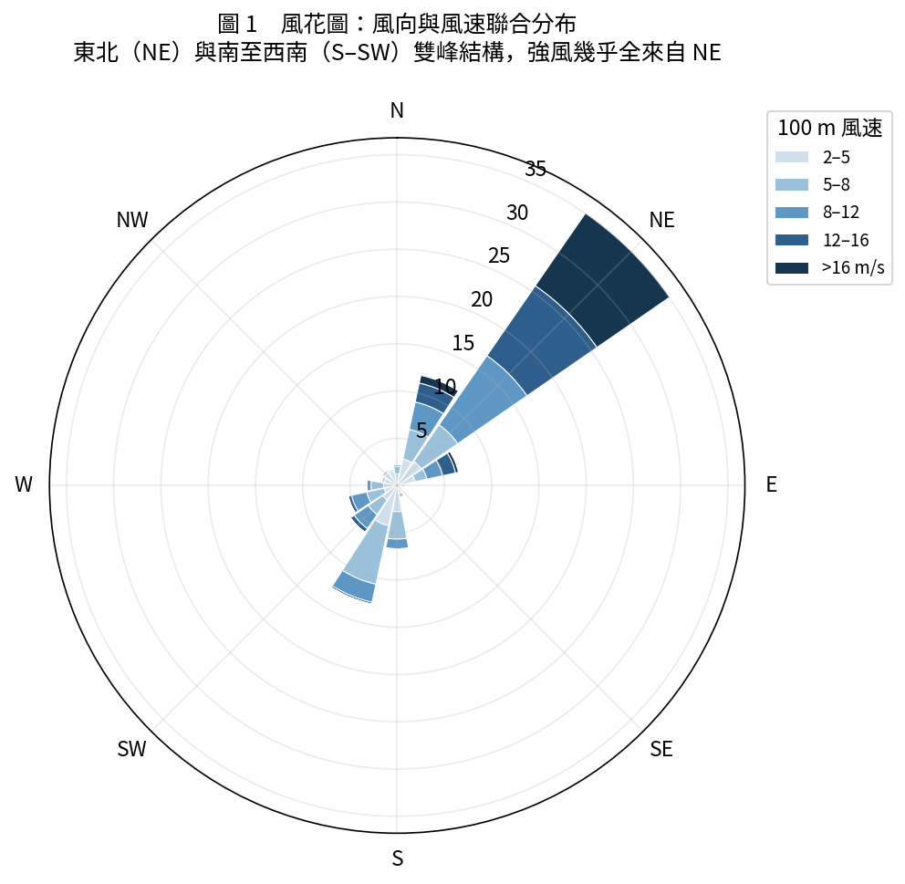

風向風速的聯合分布。這是一個**雙峰**站址：東北（NE）的東北季風，以及南到西南（S–SW）的氣流。
關鍵在於顏色——**強風（深藍，>16 m/s）幾乎全部來自東北**。這說明冬季東北季風才是這座塔的能量來源，
也預告了後面「風向決定一切」的主軸。

### 圖 2　湍流強度隨風向的變化

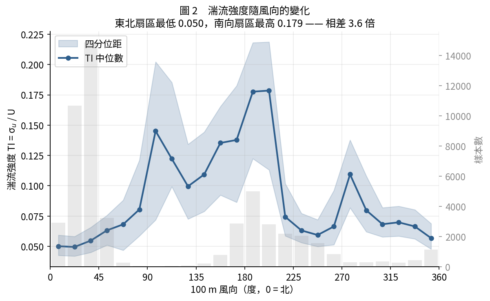

同一張圖把 TI 的中位數（藍線）、四分位距（陰影）、樣本數（灰柱）疊在一起。
東北扇區 TI 最低（約 0.05），南向扇區最高（約 0.18），**相差三倍以上**。
這就是整個專案的物理基礎：吹過海面的氣流平順、吹過陸地的氣流被地表擾動。
灰柱同時顯示絕大多數資料集中在低 TI 的東北扇區。

### 圖 3　湍流強度 vs 平均風速

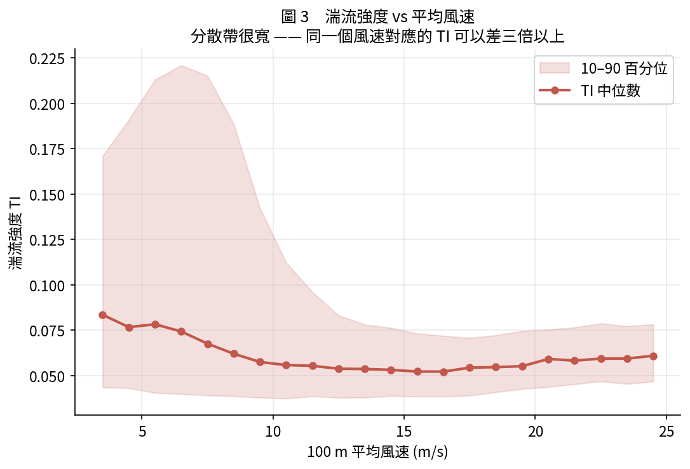

如果湍流只由風速決定，這張圖的分散帶會很窄。實際上 10–90 百分位帶**非常寬**——
同一個風速可以對應差三倍的 TI。這張圖反過來證明：**風速無法決定湍流**，
一定還有別的變數（後面會看到是風向）。

### 圖 4　季節循環

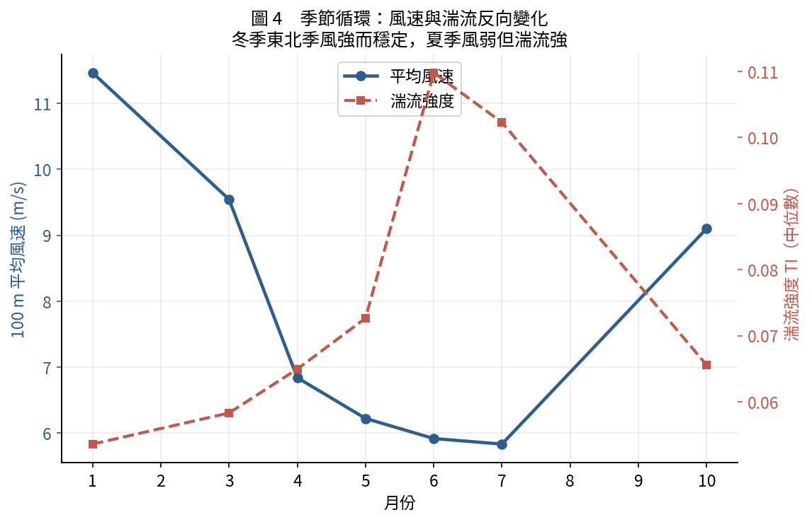

風速（藍）與湍流（紅）在一年中**反向變化**：冬季東北季風強而平穩（高風速、低 TI），
夏季風弱但擾動大（低風速、高 TI）。這也是為什麼訓練集必須橫跨完整年份——
只用某幾個月會讓模型把季節誤認成物理。

### 圖 5　日夜變化

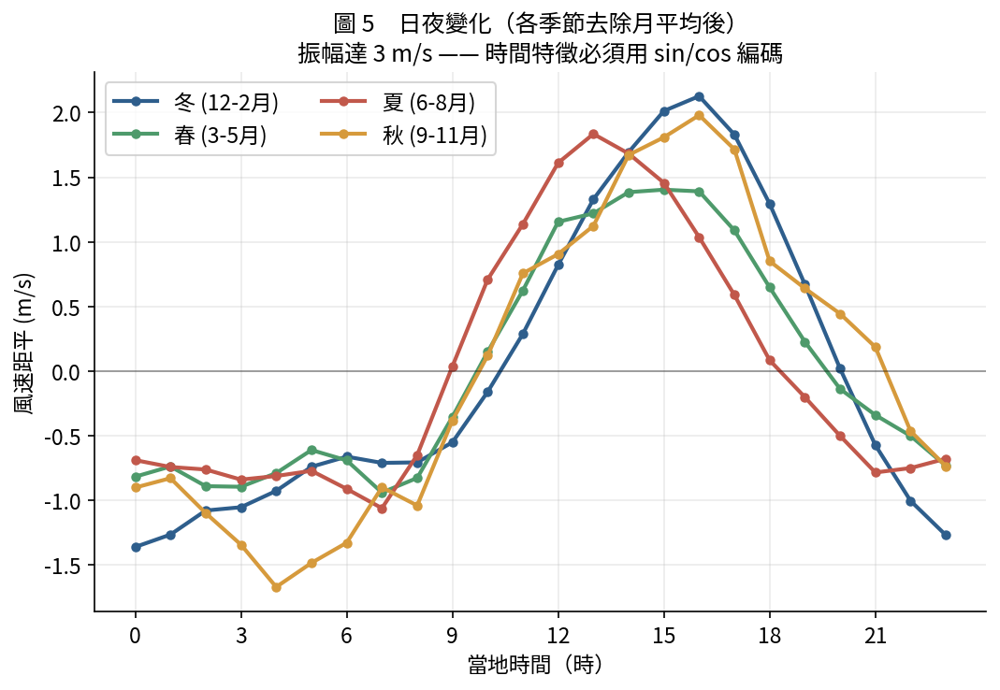

去掉月平均後的日夜距平，四季分開畫。振幅達 3 m/s，且各季相位不同。
這解釋了為什麼「小時」要用 sin/cos 週期編碼，而不是直接餵 0–23 的數字。

### 圖 6　風切指數隨風向的變化

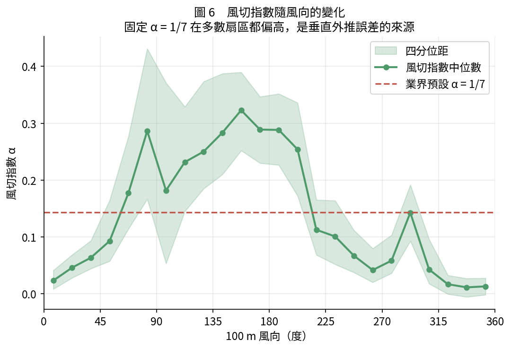

風切指數 α 隨風向大幅變化，而業界外推常用的固定值 α = 1/7（紅虛線）在多數扇區都偏高。
這張圖是**專案 B（垂直外推）** 的動機：用固定 α 把矮塔風速外推到輪轂高度，必然產生系統性誤差。

### 圖 7　湍流積分尺度分布

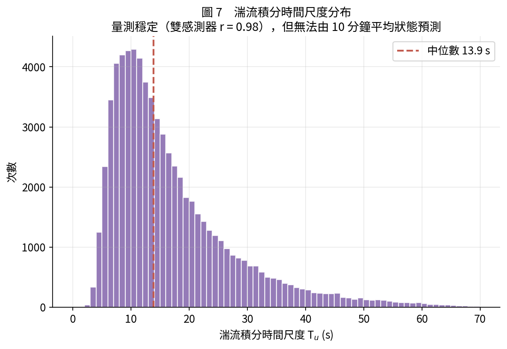

湍流積分時間尺度 T_u 的分布，中位數約 13–14 秒。這個量**量得很穩定**
（兩支感測器相關 0.98），但後面會看到它幾乎**無法被預測**——這是個誠實的負面結果。

### 圖 16　系集平均頻譜

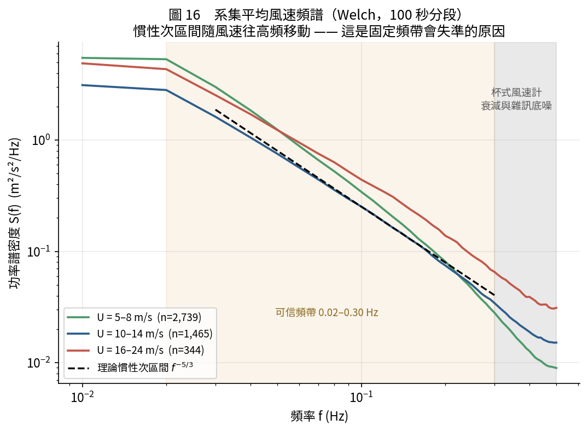

三個風速區間的平均功率譜密度（Welch 100 秒分段）。黑虛線是 Kolmogorov 理論的 −5/3 律。
兩件事很清楚：(1) 慣性次區間的位置**隨風速往高頻移動**；(2) 灰色區（>0.30 Hz）是杯式風速計的
慣性衰減與雜訊底噪，**本站沒有乾淨的 −5/3 平台**。所以頻譜量只在橘色可信頻帶（0.02–0.30 Hz）內有效。

### 圖 8　噪聲天花板

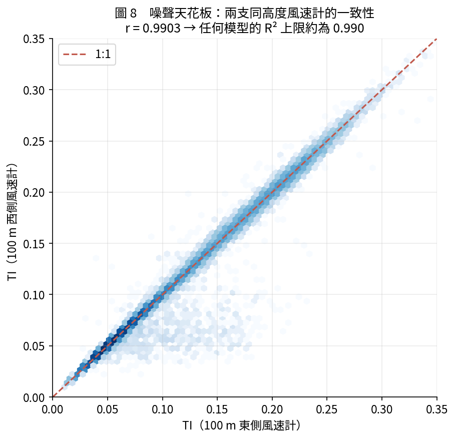

兩支同高度風速計對 TI 的一致性。它們量同一團空氣，彼此相關係數（r = 0.99）就是
**任何模型可達 R² 的物理上限**。有了這條天花板，後面「R² = 0.66」才有意義——
它是可達上限的 66%，不是一個懸空的數字。

---

## 第二部分：預測結果

### 圖 9　基準線階梯（核心結果）

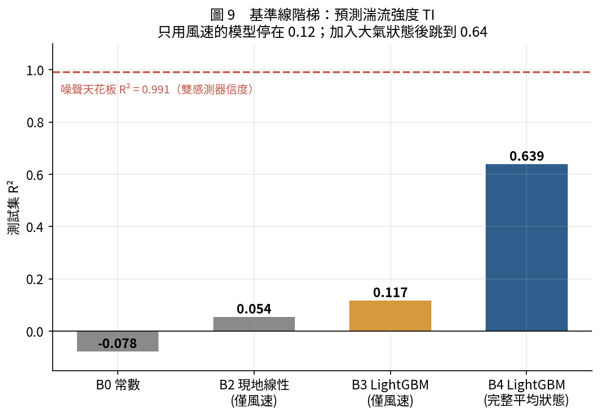

整個專案的主結果。預測湍流強度 TI，四個模型逐級疊上去：

- **B0 常數**（猜平均）：R² < 0，比亂猜還差
- **B2 現地線性**（只用風速的直線）：0.05
- **B3 LightGBM**（只用風速，但允許非線性）：0.12
- **B4 LightGBM**（完整平均狀態）：**0.64**

只用風速的模型再怎麼調都停在 0.12；**加入風向等大氣狀態後直接跳到 0.64**。
紅虛線是噪聲天花板 0.99。這一階跳躍就是本專案的論點。

### 圖 14　為什麼一定要用正規化目標

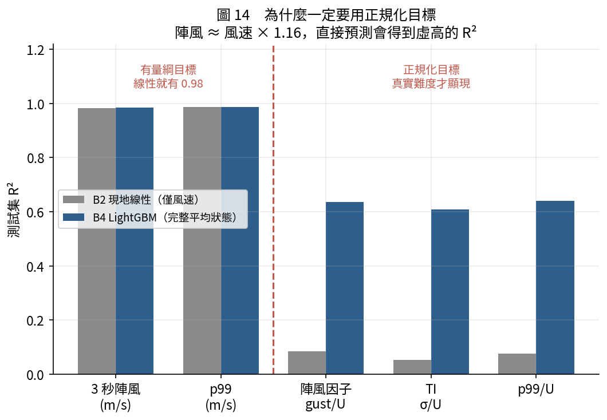

方法學上最重要的一張圖。左邊兩組（有量綱的陣風、p99）用線性就有 R² = 0.98——
但那只是因為**陣風 ≈ 風速 × 1.16**，一條直線就能拿到。機器學習的邊際貢獻幾乎是零。
右邊三組除以平均風速後，真實難度才顯現：線性掉到 0.05–0.08，完整模型才把它拉到 0.63–0.66。
**很多風能 ML 專案的「R²=0.98」其實是這個陷阱。**

### 圖 10　預測 vs 實測

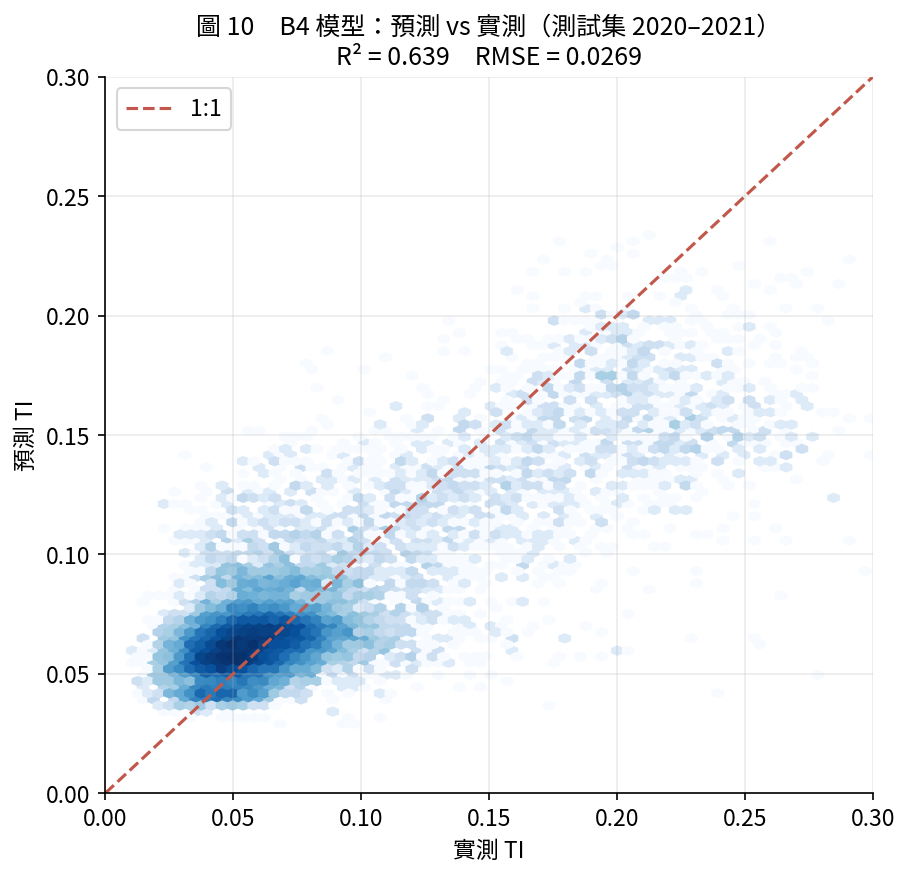

B4 模型在**測試集（2020–2021，模型從未見過）** 上的表現。點沿 1:1 線分布，
沒有明顯的系統性偏差。這是時間外推的誠實驗證——訓練用 2016–2018，測試用 2020–2021。

### 圖 11　特徵重要性

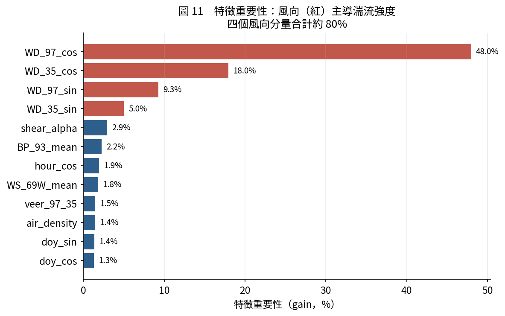

紅色是風向分量、藍色是其他。**四個風向分量合計約 80%**，其中南北分量 `WD_97_cos`
一個人就佔 48%。風速本身完全掉出前四名——因為目標 TI 已經把風速除掉了。
這張圖用資料證明了「湍流由風向決定」不是猜測。

### 圖 12　殘差的風向結構

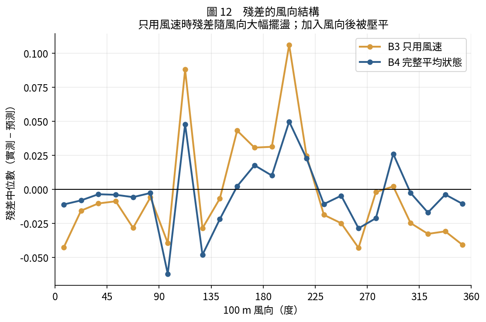

診斷圖。只用風速時（橘），殘差隨風向大幅擺盪（±0.10）——代表模型系統性地漏掉了風向資訊。
加入風向後（藍），峰值大約砍半、整體壓低。殘差仍有殘留結構，指向下一步可再改進的空間。

### 圖 15　分季節誤差分解

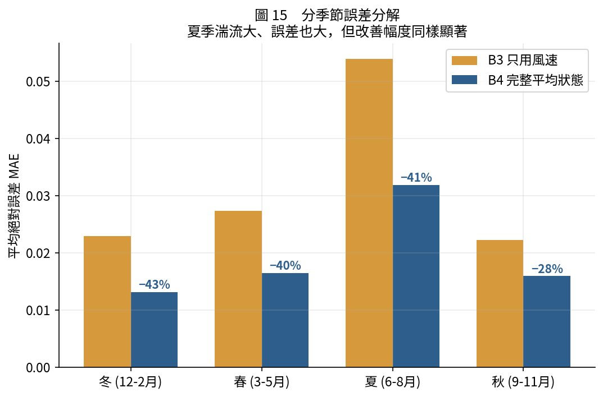

不能只報整體平均誤差。夏季湍流大、絕對誤差也大，但完整模型相對只用風速的**改善幅度
每一季都顯著**（柱上百分比）。這說明模型的價值不是只來自某個好做的季節。

### 圖 13　IEC 標準模型 vs 本站實測

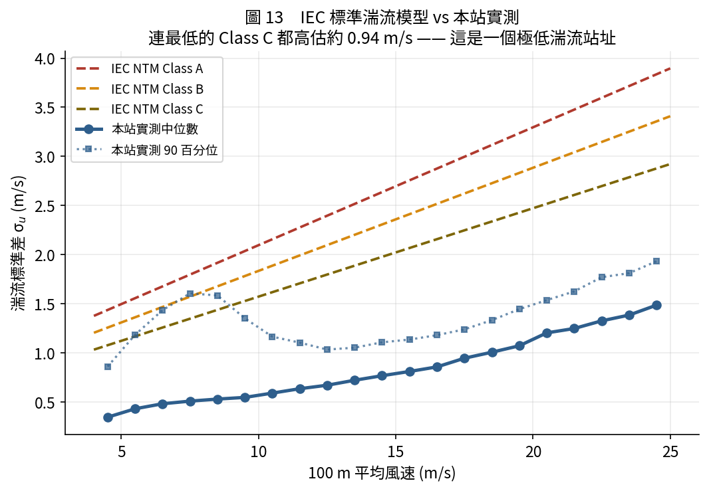

國際標準 IEC 61400-1 的三個湍流等級（虛線）vs 本站實測（藍）。
連最低的 Class C 都比實測高出約 0.94 m/s——**這是一個湍流極低的站址**，風況品質接近離岸。
實務意義：直接套用標準等級做風機載重評估，在這種站址會嚴重高估疲勞負荷。
現地校準 + 機器學習把 σ_u 的 RMSE 從 1.01 一路降到 0.23。

### 圖 17　為什麼頻譜斜率必須用約化頻率

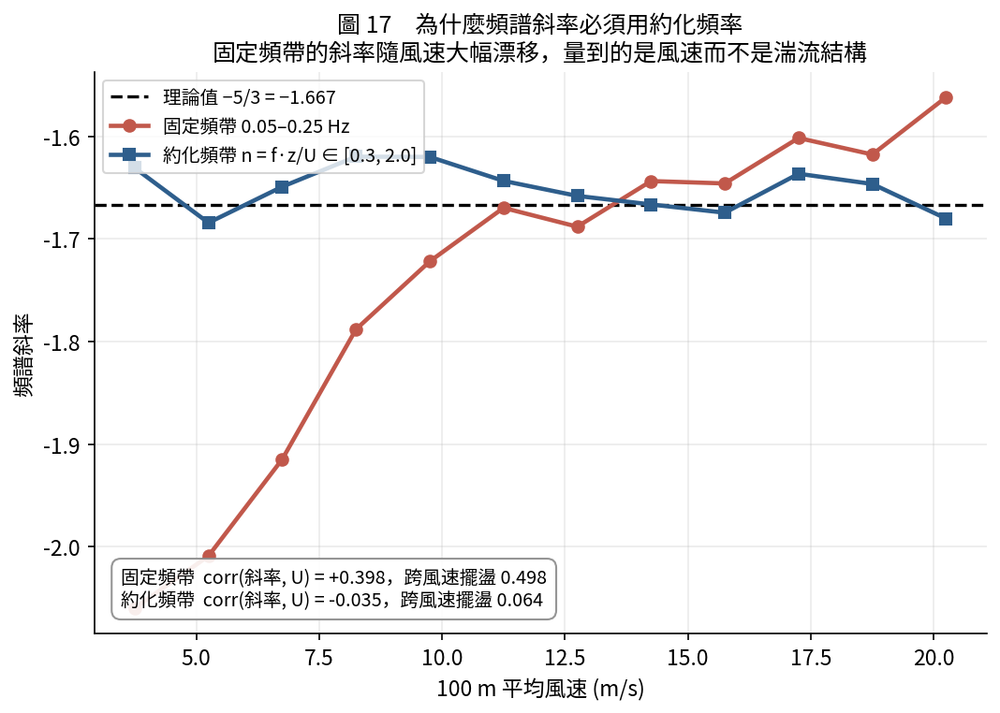

另一個方法學修正。用固定頻帶（紅）算頻譜斜率，它會隨風速從 −2.0 漂到 −1.6，
corr(斜率, 風速) = +0.40——**量到的是風速不是湍流**。改用約化頻率 n = f·z/U（藍）後，
斜率穩定貼在理論值 −5/3 附近，corr 降到 −0.035。這是「特徵工程要尊重物理」的具體案例。

---

## 誠實的負面結果

不是每個目標都能預測。這點要寫清楚，比只報成功的更有說服力：

| 目標 | 最佳模型 R² | 噪聲上限 | 判讀 |
|---|---|---|---|
| 湍流強度 TI | **0.66** | 0.99 | ✅ 大幅超越物理基準 |
| 3 秒陣風因子 | **0.63** | 0.99 | ✅ 同上 |
| p99 / U | **0.66** | 0.99 | ✅ 同上 |
| 積分時間尺度 T_u | **0.02** | 0.98 | ❌ 量得準，但預測不了 |
| 頻譜斜率 | **≈ 0** | 0.83 | ❌ 預測不了 |

T_u 特別值得說明：它**量得很穩定**（雙感測器 r = 0.98，圖 7），
但完整平均狀態模型 R² 只有 0.02。也就是說**積分尺度是實在的物理量，但它不由塔上的
10 分鐘平均狀態決定**——比較可能取決於邊界層高度、天氣系統型態這些塔上量不到的資訊。
能區分「量不準」和「量得準但預測不了」，靠的正是圖 8 的雙感測器天花板。

---

## 檔案清單

| 檔案 | 內容 |
|---|---|
| `figures/01`–`08`, `16` | 特徵觀察圖（9 張） |
| `figures/09`–`15`, `17` | 預測結果圖（8 張） |
| `benchmark.csv` | 全部目標 × 全部模型的評估數字 |
| `importance_*.csv` | 各目標的特徵重要性 |
| `../make_figures.py` | 圖 1–15 的產生程式 |
| `../make_figures_spectrum.py` | 圖 16–17（需回讀 1 Hz 原始檔） |
| `../RESULTS_turbulence_downscaling.md` | 完整文字版結果報告 |

所有 LightGBM 固定亂數種子 seed=42，數字可完全重現。目前用 17 個月抽樣；
跑完整 66 個月後結論不變，但風向分區統計會更穩定。
